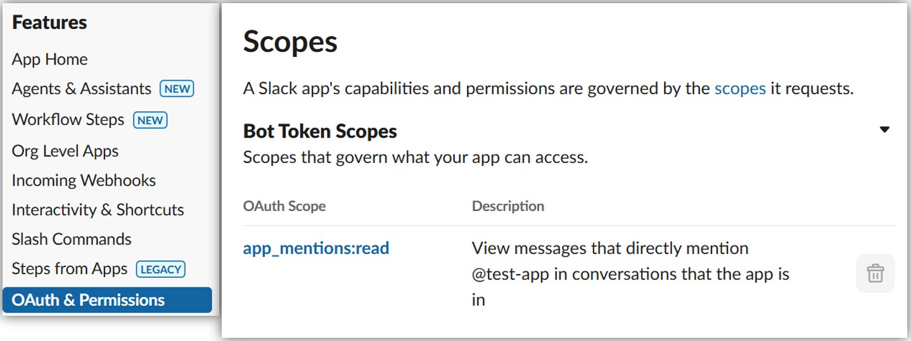

# 作成方法
- https://tools.slack.dev/bolt-python/ja-jp/getting-started/
- https://tools.slack.dev/bolt-python/api-docs/slack_bolt/kwargs_injection/args.html

## slack_bolt
- A Python framework to build Slack apps
- 参考URL
  - https://github.com/slackapi/bolt-python?tab=readme-ov-file
  - https://tools.slack.dev/bolt-python/ja-jp/getting-started/
  - https://tools.slack.dev/bolt-python/api-docs/slack_bolt/index.html

# Event契機でApp実行
## Event一覧
- https://api.slack.com/events

## 共通設定
- 環境変数で`SLACK_BOT_TOKEN`(`xoxb-***`)と`SLACK_APP_TOKEN`(`xapp-***`)を設定

## ボットがメンションされたときに反応するApp
- 参考URL
  - https://api.slack.com/events/app_mention
- 「Features」-「Event Subscriptions」の「Subscribe to bot events」にて`app_mention`を追加する  
  
- 「Features」-「OAuth & Permissions」の「Scopes」にて`app_mentions:read`を追加する  
  
- `@app.event("app_mention")`でイベントをcatchする  
  ```python
    import os
    from slack_bolt import App
    from slack_bolt.adapter.socket_mode import SocketModeHandler

    # ボットトークンとソケットモードハンドラーを使ってアプリを初期化
    app = App(token=os.environ.get("SLACK_BOT_TOKEN"))

    @app.event("app_mention")
    def message_hello(event, say):
        # イベントがトリガーされたチャンネルへ say() でメッセージを送信
        text = event["text"]
        print(text)
        # say(f"メンションを受け取りました: {text}")
        say(f"こんにちは、<@{event['user']}> さん！")
        

    if __name__ == "__main__":
        SocketModeHandler(app, os.environ["SLACK_APP_TOKEN"]).start() # アプリを起動
  ```
- `/invite @<ボット名>`でチャネルにボットを参加させる

## 特定のメッセージに反応するApp
- https://tools.slack.dev/bolt-python/ja-jp/getting-started/
- 例  
  ```python
  import os
  from slack_bolt import App
  from slack_bolt.adapter.socket_mode import SocketModeHandler

  # ボットトークンを渡してアプリを初期化します
  app = App(token=os.environ.get("SLACK_BOT_TOKEN"))

  # 'こんにちは' を含むメッセージをリッスンします
  # 指定可能なリスナーのメソッド引数の一覧は以下のモジュールドキュメントを参考にしてください：
  # https://tools.slack.dev/bolt-python/api-docs/slack_bolt/kwargs_injection/args.html
  @app.message("こんにちは")
  def message_hello(message, say):
      # イベントがトリガーされたチャンネルへ say() でメッセージを送信します
      say(f"こんにちは、<@{message['user']}> さん！")

  if __name__ == "__main__":
      # アプリを起動して、ソケットモードで Slack に接続します
      SocketModeHandler(app, os.environ["SLACK_APP_TOKEN"]).start()
  ```