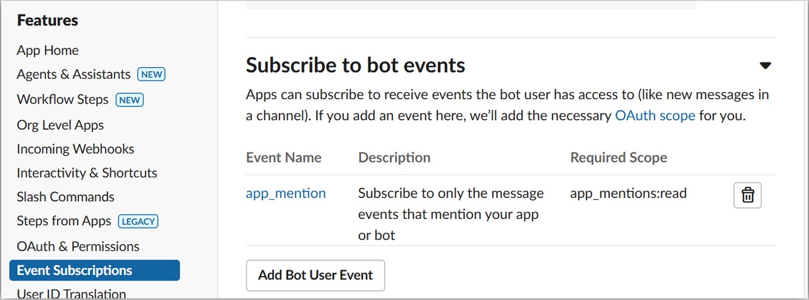
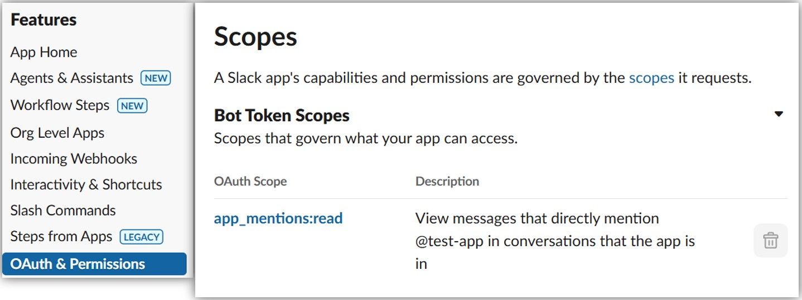
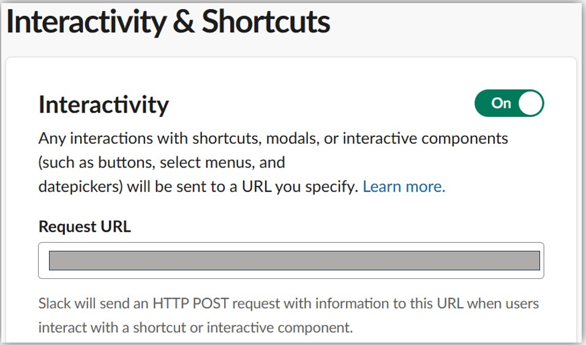

# 目次 <!-- omit in toc -->
<!-- TOC -->

- [作成方法](#作成方法)
  - [Socket Modeについて](#socket-modeについて)
- [slack\_bolt](#slack_bolt)
  - [`process_before_response`と`ack()`について](#process_before_responseとackについて)
    - [例](#例)
    - [SlackのTimeout(タイムアウト)について](#slackのtimeoutタイムアウトについて)
    - [非同期処理例のイメージ](#非同期処理例のイメージ)
    - [AWS Lambda環境では`process_before_response=True`必須](#aws-lambda環境ではprocess_before_responsetrue必須)
  - [Lazy Listenerパターン](#lazy-listenerパターン)
    - [仕組み](#仕組み)
    - [書き方](#書き方)
    - [Lazy Listenerが効くケース・効かないケース](#lazy-listenerが効くケース効かないケース)
    - [`views_open`との相性](#views_openとの相性)
  - [Slackのリトライ仕様](#slackのリトライ仕様)
    - [リトライ判定の流れ](#リトライ判定の流れ)
    - [リトライopt-out方法](#リトライopt-out方法)
    - [冪等性確保の必要性](#冪等性確保の必要性)
  - [`conversations_history`、`conversations_replies`](#conversations_historyconversations_replies)
  - [`views_open`や`views_update`メソッドで使用できる`private_metadata`について](#views_openやviews_updateメソッドで使用できるprivate_metadataについて)
    - [`private_metadata`の制約](#private_metadataの制約)
- [Event契機でApp実行](#event契機でapp実行)
  - [Event一覧](#event一覧)
  - [共通設定](#共通設定)
  - [ボットがメンションされたときに反応するApp](#ボットがメンションされたときに反応するapp)
  - [特定のメッセージに反応するApp](#特定のメッセージに反応するapp)
- [AWS API Gateway + Lambdaと連携](#aws-api-gateway--lambdaと連携)
- [Lambdaコールドスタートへの対処](#lambdaコールドスタートへの対処)
  - [対策一覧](#対策一覧)
  - [`process_before_response=False`は解決策にならない](#process_before_responsefalseは解決策にならない)
  - [推奨される複合戦略](#推奨される複合戦略)
- [Interactiveな応答を処理する設定](#interactiveな応答を処理する設定)

<!-- /TOC -->

# 作成方法
- https://tools.slack.dev/bolt-python/ja-jp/getting-started/
- https://tools.slack.dev/bolt-python/api-docs/slack_bolt/kwargs_injection/args.html
- https://dev.classmethod.jp/articles/amazon-bedrock-slack-chat-bot-part2/

## Socket Modeについて
- https://dev.classmethod.jp/articles/amazon-bedrock-slack-chat-bot-part1/

# slack_bolt
- A Python framework to build Slack apps
- 参考URL
  - https://github.com/slackapi/bolt-python?tab=readme-ov-file
  - https://tools.slack.dev/bolt-python/ja-jp/getting-started/
  - https://tools.slack.dev/bolt-python/api-docs/slack_bolt/index.html

## `process_before_response`と`ack()`について
- Bolt for Python では、デフォルトではすべてのリクエストを処理した後にSlackにレスポンス（`ack()`）を返す
- しかし、この動作を変更し、リクエストの処理が完了する前に即座に Slack に応答を返すようにするのが`process_before_response=True`の設定
- `process_before_response=True`を設定することで、先に`ack()`を返し、その後に時間のかかる処理を非同期的に実行することができる
### 例
- `process_before_response=False`の場合  
  ```python
  app = App(
      token=os.environ["SLACK_BOT_TOKEN"],
      signing_secret=os.environ["SLACK_SIGNING_SECRET"]
  )

  @app.event("app_mention")
  def handle_mention(ack, say):
      # リクエストを処理してから `ack()` を返す（3秒以内に処理が完了する必要がある）
      result = some_quick_function()  # 処理が短い
      ack()  # 完了後に応答
      say(f"処理結果: {result}")
  ```
- `process_before_response=True`の場合  
  ```python
  app = App(
      token=os.environ["SLACK_BOT_TOKEN"],
      signing_secret=os.environ["SLACK_SIGNING_SECRET"],
      process_before_response=True  # 処理前に応答を返す
  )

  @app.event("app_mention")
  def handle_mention(ack, say):
      ack()  # 先に応答を返す（Slackのタイムアウトを回避）
      result = some_long_running_task()  # 時間のかかる処理
      say(f"処理結果: {result}")
  ```
### SlackのTimeout(タイムアウト)について
- Slack では、3秒以内に`ack()` (リクエストの確認応答) を返す必要がある。`ack()`を返さないと Slack はタイムアウトとみなし、エラー扱いになる。
- Slack の推奨パターンとしては 「先に`ack()`で応答してから、重い処理は後続の非同期タスクで行う」 というやり方をとるのがベストプラクティス
### 非同期処理例のイメージ
- ボタン押下などのイベント発生 → `ack()`をすぐ返す (Slack側はタイムアウトしない)
- その後、Lambda ではキュー（SQS）にリクエストを投げるなど別の方法で時間のかかる処理を実行する
- 結果を別途Slackに`chat.postMessage`や`say()`などで投稿

### AWS Lambda環境では`process_before_response=True`必須
- `process_before_response=False`(デフォルト)は **「`ack()`を呼んだ瞬間にHTTP応答を返し、その後の処理は同じプロセス内で継続」** という挙動を前提としており、**長時間稼働するWebサーバープロセス向け**の設計
- AWS Lambdaは **「ハンドラ関数の return ＝ HTTP応答」** という request/response モデルなので、`ack()` を呼んでも HTTP 応答は即座には返らない（Lambdaの制約）
- Slack Bolt公式ドキュメントでも **AWS Lambdaでは `process_before_response=True` 必須** と明記
- Lambda で非同期にしたい場合は後述の[Lazy Listenerパターン](#lazy-listenerパターン)を使用する

## Lazy Listenerパターン
- Slack BoltがAWS Lambda向けに用意している非同期実行機構
- 参考URL
  - https://tools.slack.dev/bolt-python/concepts/lazy-listeners/
  - https://github.com/slackapi/bolt-python/tree/main/examples/aws_lambda

### 仕組み
1. Slack → Lambda にイベント送信
2. Lambda起動 → `ack`関数（軽い処理のみ）を実行 → Slackに即200応答
3. **Bolt が自動的に「別のLambda invocation」を非同期発火**（同じLambda関数を自己呼び出し）
4. その second invocation で `lazy` の関数を実行（重い処理）
5. first invocation は ack 後すぐ終了 ＝ Slackは即応答受け取り

→ Slack側のタイムアウト問題は実質解消、重い処理は別Lambdaで最大15分まで実行可能

### 書き方
```python
def just_ack(ack):
    ack()  # 軽い処理だけ

def actual_handler(body, client):
    # 重い処理（外部API呼び出し、複数HTTPリクエストなど）
    ...

# action / event / view すべてで lazy 指定可能
app.action("my_action")(ack=just_ack, lazy=[actual_handler])
app.event("app_mention")(ack=lambda: None, lazy=[actual_handler])
app.view("my_modal")(ack=just_ack, lazy=[actual_handler])
```

通常の`@app.action("...")`デコレータと書き方が違う点に注意。

### Lazy Listenerが効くケース・効かないケース

| シナリオ | 同期パターン (`process_before_response=True` のみ) | Lazy パターン |
|---|---|---|
| **warm, 処理100ms** | OK | OK |
| **warm, 処理5秒** | ❌ タイムアウト | ✅ ack即時返却、別Lambdaで5秒処理 |
| **cold, 処理100ms** | コールドスタート時間次第。3秒以内ならOK | 同じ（cold start中はackも呼ばれない） |
| **cold, 処理5秒** | ❌ ほぼ確実にタイムアウト | コールドスタート時間次第 |

**Lazyは「Lambdaが温まっていれば重い処理でも対応可能」にする機構**であって、コールドスタートそのものは解決しない（[コールドスタート対策](#lambdaコールドスタートへの対処)参照）。

### `views_open`との相性
- `views_open`に必要な`trigger_id`は **Slackがaction送信した時刻から3秒間しか有効ではない**
- Lazy listenerで `views_open` を呼ぶと、second invocation開始までの待ち時間でtrigger_idが失効しやすい
- **モーダル開きの処理だけは lazy にせず、ack 関数側（main invocation）で同期実行する**のが安全
- Lazy側には重い後続処理（DB更新、外部API連携など）だけ寄せる

## Slackのリトライ仕様
- 参考URL
  - https://api.slack.com/apis/events-api#retries
- Slackは Events API / Interactivity payload送信に対し**標準でリトライ機構**を持っている（こちらでは設定不要・無効化も通常はしない）

### リトライ判定の流れ
1. Slackがイベントをbotのエンドポイントへ送信（`trigger_id`等も含む）
2. **3秒以内にHTTP 200応答**を返さないと「失敗」と判定
3. **最大3回**まで自動で再送（おおむね即時 → 1分 → 5分の間隔、公式の保証はない）
4. リトライ時のリクエストヘッダ：
   - `X-Slack-Retry-Num`: リトライ回数（0=初回、1以上=リトライ）
   - `X-Slack-Retry-Reason`: リトライ理由（`http_timeout`等）

### リトライopt-out方法
- 応答ヘッダに **`X-Slack-No-Retry: 1`** を付けるとリトライしないようSlackに伝えられる
- ただし「失敗してもメッセージロストする」リスクを受け入れることになるので、通常は使わない
- 推奨は「**リトライに耐えられる冪等なコード**を書く」こと

### 冪等性確保の必要性
- Lazy listener化してもSlackのリトライ機構は変わらない（コールドスタートで初回ackが遅れたら結局再送される）
- そのため**重複実行に耐える設計**が必要：
  - DynamoDB等にidempotency key（`event_id`、`view_id`、`trigger_id`など）を保存し、既処理なら早期return
  - Slack Bolt request contextからリトライ番号を取得して2回目以降は無視する方法もある：
    ```python
    @app.action("my_action")
    def handler(ack, body, client, request):
        if request.context.retry_num and int(request.context.retry_num) > 0:
            ack()
            return  # リトライは無視
        ...
    ```
    ただしリトライを無視するとSlackには成功と見せかけることになるので、初回処理が本当に失敗していた場合の補完が別途必要
- コメント投稿のような**非冪等な副作用**は特に重要（重複コメントになるため）

## `conversations_history`、`conversations_replies`
- https://api.slack.com/methods/conversations.history
- https://api.slack.com/methods/conversations.replies
- `conversations_history`はチャネルのすべての会話履歴をとってくるもので、`conversations_replies`は特定のメッセージ(スレッド)の会話履歴をとってくるもの
- `conversations_history`と`conversations_replies`APIを使用するためには、以下のスコープのいずれかが必要
  - `channels:history` - パブリックチャンネルの履歴を読む権限
  - `groups:history` - プライベートチャンネルの履歴を読む権限
  - `mpim:history` - マルチパーソンDMの履歴を読む権限
  - `im:history` - DMの履歴を読む権限

## `views_open`や`views_update`メソッドで使用できる`private_metadata`について
- `private_metadata`はモーダルを開いた際に、サーバー側で必要なコンテキストデータを埋め込むために使われる
- `private_metadata`で連携した値は`view["private_metadata"]`で取得できる
- 例  
  ```python
  @app.action("execute_command")
  def execute_command(ack, body, client):
      ack()  # ボタンクリックの確認

      # ボタンで渡された値を取得
      command = body["actions"][0]["value"]
      channel_id = body["channel"]["id"]
      thread_ts = body["message"]["ts"]
      analysis_result_and_command = body["message"]["blocks"][0]

      # モーダルを開く
      try:
          client.views_open(
              trigger_id=body["trigger_id"],
              view={
                  "type": "modal",
                  "title": {
                      "type": "plain_text",
                      "text": "実行確認"
                  },
                  "blocks": [
                      {
                          "type": "section",
                          "text": {
                              "type": "mrkdwn",
                              "text": f"本当に以下のコマンドを実行しますか？\n```\n{command}\n```"
                          }
                      }
                  ],
                  "submit": {
                      "type": "plain_text",
                      "text": "実行する"
                  },
                  "close": {
                      "type": "plain_text",
                      "text": "やめる"
                  },
                  "callback_id": "command_confirmation",  # このIDで後でハンドリングする
                  "private_metadata": json.dumps({       # 必要な情報を保存
                      "command": command,
                      "channel_id": channel_id,
                      "thread_ts": thread_ts
                  })
              }
          )
      except Exception as e:
          print(f"Error opening modal: {e}")

  # モーダルの送信（実行するボタン）が押された時のハンドラー
  @app.view("command_confirmation")
  def handle_command_execution(ack, body, client, view):
      ack()

      # private_metadataから保存した情報を取得
      metadata = json.loads(view["private_metadata"])
      command = metadata["command"]
      channel_id = metadata["channel_id"]
      thread_ts = metadata["thread_ts"]

      previous_message = client.conversations_replies(
          channel=channel_id,
          ts=thread_ts
      )

      previous_message_blocks = previous_message["messages"][-1]["blocks"]
      analysis_result_and_command = previous_message_blocks[0]

      try:
          send_sqs_command_message(os.environ.get("SQS_QUEUE_FOR_COMMAND_URL"),command, thread_ts, channel_id)
      except Exception as e:
          print("Error sending message to sqs for command:", str(e))

      updated_blocks = [
          # 最初のブロック（analysis_results）はそのまま保持
          analysis_result_and_command,
          # 2番目のブロック（action_buttons）を新しい内容に更新
          {
              "type": "section",
              "block_id": "action_buttons",
              "text": {
                  "type": "mrkdwn",
                  "text": "コマンドを実行します。しばらくお待ちください。"
              }
          }
      ]
      client.chat_update(
          channel=channel_id,
          ts=thread_ts,
          text="",
          blocks=updated_blocks
      )
  ```

### `private_metadata`の制約
- `private_metadata`に入れたデータが3001文字数を超えると以下のエラーが出る  
  ```
  Error opening modal: The request to the Slack API failed. (url: https://slack.com/api/views.open)
  The server responded with: {'ok': False, 'error': 'invalid_arguments', 'response_metadata': {'messages': ['[ERROR] failed to match all allowed schemas [json-pointer:/view]', '[ERROR] must be less than 3001 characters [json-pointer:/view/private_metadata]']}}
  ```

# Event契機でApp実行
## Event一覧
- https://api.slack.com/events

## 共通設定
- 環境変数で`SLACK_BOT_TOKEN`(`xoxb-***`)と`SLACK_APP_TOKEN`(`xapp-***`)を設定

## ボットがメンションされたときに反応するApp
- 参考URL
  - https://api.slack.com/events/app_mention
- 「Features」-「Event Subscriptions」の「Subscribe to bot events」にて`app_mention`を追加する  
  
- 「Features」-「OAuth & Permissions」の「Scopes」にて`app_mentions:read`を追加する  
  
- `@app.event("app_mention")`でイベントをcatchする  
  ```python
    import os
    from slack_bolt import App
    from slack_bolt.adapter.socket_mode import SocketModeHandler

    # ボットトークンとソケットモードハンドラーを使ってアプリを初期化
    app = App(token=os.environ.get("SLACK_BOT_TOKEN"))

    @app.event("app_mention")
    def message_hello(event, say):
        # イベントがトリガーされたチャンネルへ say() でメッセージを送信
        text = event["text"]
        print(text)
        # say(f"メンションを受け取りました: {text}")
        say(f"こんにちは、<@{event['user']}> さん！")

    if __name__ == "__main__":
        SocketModeHandler(app, os.environ["SLACK_APP_TOKEN"]).start() # アプリを起動
  ```
- `/invite @<ボット名>`でチャネルにボットを参加させる
  - `/remove @<ボット名>`でチャネルから削除も可能

## 特定のメッセージに反応するApp
- https://tools.slack.dev/bolt-python/ja-jp/getting-started/
- 例  
  ```python
  import os
  from slack_bolt import App
  from slack_bolt.adapter.socket_mode import SocketModeHandler

  # ボットトークンを渡してアプリを初期化します
  app = App(token=os.environ.get("SLACK_BOT_TOKEN"))

  # 'こんにちは' を含むメッセージをリッスンします
  # 指定可能なリスナーのメソッド引数の一覧は以下のモジュールドキュメントを参考にしてください：
  # https://tools.slack.dev/bolt-python/api-docs/slack_bolt/kwargs_injection/args.html
  @app.message("こんにちは")
  def message_hello(message, say):
      # イベントがトリガーされたチャンネルへ say() でメッセージを送信します
      say(f"こんにちは、<@{message['user']}> さん！")

  if __name__ == "__main__":
      # アプリを起動して、ソケットモードで Slack に接続します
      SocketModeHandler(app, os.environ["SLACK_APP_TOKEN"]).start()
  ```

# AWS API Gateway + Lambdaと連携
- 参考URL
  - https://www.beex-inc.com/blog/slackbot-aws-lambda-python
  - https://tools.slack.dev/bolt-python/api-docs/slack_bolt/adapter/aws_lambda/index.html
- コード例  
  ```python
  import os
  import re
  from slack_bolt import App
  from slack_bolt.adapter.aws_lambda import SlackRequestHandler

  # アプリを初期化
  app = App(
      token=os.environ.get("SLACK_BOT_TOKEN"),
      signing_secret=os.environ.get("SLACK_SIGNING_SECRET"),
      process_before_response=True, # デフォルトではすべてのリクエストを処理した後にレスポンスを返すが、Trueにすることでリクエストを処理する前にレスポンスを返す
  )

  @app.event("app_mention")
  def message_hello(event, say):
      # イベントがトリガーされたチャンネルへ say() でメッセージを送信
      text = event["text"]
      say(f"こんにちは、<@{event['user']}> さん！")
      say(f"次のメッセージを受け取りました: {text}")

  # Lambdaイベントハンドラー
  def handler(event, context):
      slack_handler = SlackRequestHandler(app=app)
      return slack_handler.handle(event, context)
  ```
- `Dockerfile`例  
  ```dockerfile
  FROM public.ecr.aws/lambda/python:3.13
  COPY requirements.txt app.py ${LAMBDA_TASK_ROOT}/
  RUN pip3 install -r requirements.txt
  CMD [ "app.handler" ]
  ```

# Lambdaコールドスタートへの対処
- 参考URL
  - https://docs.aws.amazon.com/lambda/latest/dg/provisioned-concurrency.html
  - https://docs.aws.amazon.com/lambda/latest/dg/snapstart.html
- Lambdaのコンテナ起動・依存ライブラリ初期化・モジュールimportの所要時間（典型的に1-10秒）
- Slackの3秒タイムアウトの起点は **Slackがリクエストを送信した瞬間**（ボタン押下直後）なので、**コールドスタート時間 > 3秒**なら`ack()`到達前にSlack側でタイムアウト判定 → 再送される
- Lazy Listenerでも、`process_before_response`の設定変更でも、**コードレベルでは解決不可能**

## 対策一覧

| 手段 | 効果 | コスト・注意点 |
|---|---|---|
| **Provisioned Concurrency** | コールドスタートを完全に消せる（指定インスタンス数まで） | 常時課金（待機料金が発生） |
| **Lambda SnapStart** | コールドスタートを大幅短縮 | **Java/Python/.NET のみ**（Pythonは2024-12からサポート開始） |
| **Lambda Warmer** (EventBridgeで定期ping) | 1インスタンスを温めておける | 並行リクエストが来るとcold startが発生する |
| **コンテナサイズ縮小・import最適化** | 初期化時間そのものを短縮 | 効果が限定的だが手っ取り早い |
| **アーキテクチャ変更** (例: API Gateway直接SQS連携 + Lambdaは非同期処理だけ) | Slack側にはAPI Gateway/SQSが即200を返すので3秒制約から解放 | 改修コスト大、Slackのpayload検証ロジックを別途実装する必要あり |

## `process_before_response=False`は解決策にならない
- 直感的に「先にackを返せばタイムアウトしない」と考えがちだが、**Lambdaでは使えない**
- 理由：`process_before_response=False`はWebサーバープロセス前提で「ack()呼び出し時点でHTTP応答を返し、同プロセス内で処理を継続」する仕組み。Lambdaは「ハンドラreturn＝HTTP応答」のrequest/responseモデルなので動作しない
- Lambdaで非同期にしたい場合は**`process_before_response=True`を維持したまま [Lazy Listener パターン](#lazy-listenerパターン)**を使う

## 推奨される複合戦略
1. **Lazy Listener化**: warm時の安定性を確保（重い処理が原因のタイムアウトをなくす）
2. **idempotency keyによる重複排除**: lazyにしてもcold start起因のリトライは発生し得るため、冪等化で重複被害を最小化
3. **SnapStart または Provisioned Concurrency**: cold start自体を排除（インフラ層での根本解決）

# Interactiveな応答を処理する設定
- Slackから送信されたbuttonを押したときなど、Slackで継続的なやりとりをするためには「**Interactivity**」を有効にする必要がある
- 「Interactivity & Shortcuts」の「Interactivity」を有効にして「Request URL」に、「Event Subscriptions」の「Enable Events」の「Request URL」に入力したのと同じURLを入力する  
  
