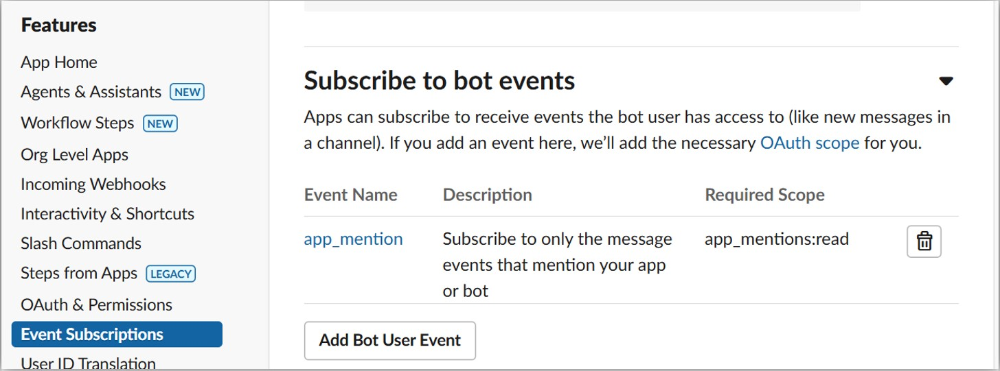

# 目次 <!-- omit in toc -->
<!-- TOC -->

- [作成方法](#作成方法)
  - [Socket Modeについて](#socket-modeについて)
- [slack\_bolt](#slack_bolt)
  - [`process_before_response`と`ack()`について](#process_before_responseとackについて)
    - [例](#例)
    - [SlackのTimeout(タイムアウト)について](#slackのtimeoutタイムアウトについて)
    - [非同期処理例のイメージ](#非同期処理例のイメージ)
- [Event契機でApp実行](#event契機でapp実行)
  - [Event一覧](#event一覧)
  - [共通設定](#共通設定)
  - [ボットがメンションされたときに反応するApp](#ボットがメンションされたときに反応するapp)
  - [特定のメッセージに反応するApp](#特定のメッセージに反応するapp)
- [AWS API Gateway + Lambdaと連携](#aws-api-gateway--lambdaと連携)
- [Interactiveな応答を処理する設定](#interactiveな応答を処理する設定)

<!-- /TOC -->

# 作成方法
- https://tools.slack.dev/bolt-python/ja-jp/getting-started/
- https://tools.slack.dev/bolt-python/api-docs/slack_bolt/kwargs_injection/args.html
- https://dev.classmethod.jp/articles/amazon-bedrock-slack-chat-bot-part2/

## Socket Modeについて
- https://dev.classmethod.jp/articles/amazon-bedrock-slack-chat-bot-part1/

# slack_bolt
- A Python framework to build Slack apps
- 参考URL
  - https://github.com/slackapi/bolt-python?tab=readme-ov-file
  - https://tools.slack.dev/bolt-python/ja-jp/getting-started/
  - https://tools.slack.dev/bolt-python/api-docs/slack_bolt/index.html

## `process_before_response`と`ack()`について
- Bolt for Python では、デフォルトではすべてのリクエストを処理した後にSlackにレスポンス（`ack()`）を返す
- しかし、この動作を変更し、リクエストの処理が完了する前に即座に Slack に応答を返すようにするのが`process_before_response=True`の設定
- `process_before_response=True`を設定することで、先に`ack()`を返し、その後に時間のかかる処理を非同期的に実行することができる
### 例
- `process_before_response=False`の場合  
  ```python
  app = App(
      token=os.environ["SLACK_BOT_TOKEN"],
      signing_secret=os.environ["SLACK_SIGNING_SECRET"]
  )

  @app.event("app_mention")
  def handle_mention(ack, say):
      # リクエストを処理してから `ack()` を返す（3秒以内に処理が完了する必要がある）
      result = some_quick_function()  # 処理が短い
      ack()  # 完了後に応答
      say(f"処理結果: {result}")
  ```
- `process_before_response=True`の場合  
  ```python
  app = App(
      token=os.environ["SLACK_BOT_TOKEN"],
      signing_secret=os.environ["SLACK_SIGNING_SECRET"],
      process_before_response=True  # 処理前に応答を返す
  )

  @app.event("app_mention")
  def handle_mention(ack, say):
      ack()  # 先に応答を返す（Slackのタイムアウトを回避）
      result = some_long_running_task()  # 時間のかかる処理
      say(f"処理結果: {result}")
  ```
### SlackのTimeout(タイムアウト)について
- Slack では、3秒以内に`ack()` (リクエストの確認応答) を返す必要がある。`ack()`を返さないと Slack はタイムアウトとみなし、エラー扱いになる。
- Slack の推奨パターンとしては 「先に`ack()`で応答してから、重い処理は後続の非同期タスクで行う」 というやり方をとるのがベストプラクティス
### 非同期処理例のイメージ
- ボタン押下などのイベント発生 → `ack()`をすぐ返す (Slack側はタイムアウトしない)
- その後、Lambda ではキュー（SQS）にリクエストを投げるなど別の方法で時間のかかる処理を実行する
- 結果を別途Slackに`chat.postMessage`や`say()`などで投稿

## `conversations_history`、`conversations_replies`
- https://api.slack.com/methods/conversations.history
- https://api.slack.com/methods/conversations.replies
- `conversations_history`はチャネルのすべての会話履歴をとってくるもので、`conversations_replies`は特定のメッセージ(スレッド)の会話履歴をとってくるもの
- `conversations_history`と`conversations_replies`APIを使用するためには、以下のスコープのいずれかが必要
  - `channels:history` - パブリックチャンネルの履歴を読む権限
  - `groups:history` - プライベートチャンネルの履歴を読む権限
  - `mpim:history` - マルチパーソンDMの履歴を読む権限
  - `im:history` - DMの履歴を読む権限

# Event契機でApp実行
## Event一覧
- https://api.slack.com/events

## 共通設定
- 環境変数で`SLACK_BOT_TOKEN`(`xoxb-***`)と`SLACK_APP_TOKEN`(`xapp-***`)を設定

## ボットがメンションされたときに反応するApp
- 参考URL
  - https://api.slack.com/events/app_mention
- 「Features」-「Event Subscriptions」の「Subscribe to bot events」にて`app_mention`を追加する  
  
- 「Features」-「OAuth & Permissions」の「Scopes」にて`app_mentions:read`を追加する  
  
- `@app.event("app_mention")`でイベントをcatchする  
  ```python
    import os
    from slack_bolt import App
    from slack_bolt.adapter.socket_mode import SocketModeHandler

    # ボットトークンとソケットモードハンドラーを使ってアプリを初期化
    app = App(token=os.environ.get("SLACK_BOT_TOKEN"))

    @app.event("app_mention")
    def message_hello(event, say):
        # イベントがトリガーされたチャンネルへ say() でメッセージを送信
        text = event["text"]
        print(text)
        # say(f"メンションを受け取りました: {text}")
        say(f"こんにちは、<@{event['user']}> さん！")

    if __name__ == "__main__":
        SocketModeHandler(app, os.environ["SLACK_APP_TOKEN"]).start() # アプリを起動
  ```
- `/invite @<ボット名>`でチャネルにボットを参加させる
  - `/remove @<ボット名>`でチャネルから削除も可能

## 特定のメッセージに反応するApp
- https://tools.slack.dev/bolt-python/ja-jp/getting-started/
- 例  
  ```python
  import os
  from slack_bolt import App
  from slack_bolt.adapter.socket_mode import SocketModeHandler

  # ボットトークンを渡してアプリを初期化します
  app = App(token=os.environ.get("SLACK_BOT_TOKEN"))

  # 'こんにちは' を含むメッセージをリッスンします
  # 指定可能なリスナーのメソッド引数の一覧は以下のモジュールドキュメントを参考にしてください：
  # https://tools.slack.dev/bolt-python/api-docs/slack_bolt/kwargs_injection/args.html
  @app.message("こんにちは")
  def message_hello(message, say):
      # イベントがトリガーされたチャンネルへ say() でメッセージを送信します
      say(f"こんにちは、<@{message['user']}> さん！")

  if __name__ == "__main__":
      # アプリを起動して、ソケットモードで Slack に接続します
      SocketModeHandler(app, os.environ["SLACK_APP_TOKEN"]).start()
  ```

# AWS API Gateway + Lambdaと連携
- 参考URL
  - https://www.beex-inc.com/blog/slackbot-aws-lambda-python
  - https://tools.slack.dev/bolt-python/api-docs/slack_bolt/adapter/aws_lambda/index.html
- コード例  
  ```python
  import os
  import re
  from slack_bolt import App
  from slack_bolt.adapter.aws_lambda import SlackRequestHandler

  # アプリを初期化
  app = App(
      token=os.environ.get("SLACK_BOT_TOKEN"),
      signing_secret=os.environ.get("SLACK_SIGNING_SECRET"),
      process_before_response=True, # デフォルトではすべてのリクエストを処理した後にレスポンスを返すが、Trueにすることでリクエストを処理する前にレスポンスを返す
  )

  @app.event("app_mention")
  def message_hello(event, say):
      # イベントがトリガーされたチャンネルへ say() でメッセージを送信
      text = event["text"]
      say(f"こんにちは、<@{event['user']}> さん！")
      say(f"次のメッセージを受け取りました: {text}")

  # Lambdaイベントハンドラー
  def handler(event, context):
      slack_handler = SlackRequestHandler(app=app)
      return slack_handler.handle(event, context)
  ```
- `Dockerfile`例  
  ```dockerfile
  FROM public.ecr.aws/lambda/python:3.13
  COPY requirements.txt app.py ${LAMBDA_TASK_ROOT}/
  RUN pip3 install -r requirements.txt
  CMD [ "app.handler" ]
  ```

# Interactiveな応答を処理する設定
- Slackから送信されたbuttonを押したときなど、Slackで継続的なやりとりをするためには「**Interactivity**」を有効にする必要がある
- 「Interactivity & Shortcuts」の「Interactivity」を有効にして「Request URL」に、「Event Subscriptions」の「Enable Events」の「Request URL」に入力したのと同じURLを入力する  
  
