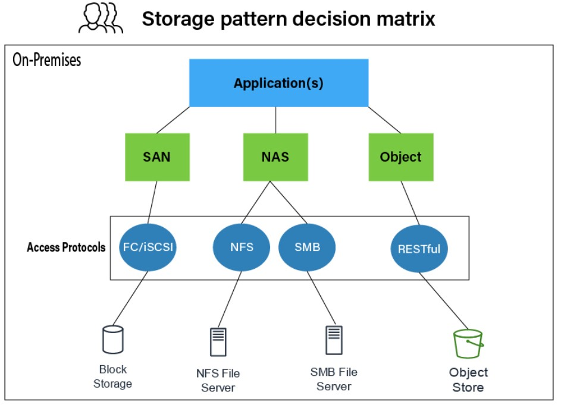

# Strage Pattern

- https://aws.amazon.com/jp/blogs/storage/comparing-your-on-premises-storage-patterns-with-aws-storage-services/

## SSDのインタフェース
- SATA（Serial ATA）
- NVMe（Non-Volatile Memory Express）
- SAS（Serial Attached SCSI）

## VMからSSDへのアクセスの流れ
- VM → iSCSI/FC(Fibre Channel) → SANコントローラ → SATA/SAS/NVMe → 物理SSD

## AWS EBS
- EBSもSANのようなものでVMからEBSにはiSCSIもしくはFC(Fibre Channel)で接続されていると思われる
- https://www.reddit.com/r/aws/comments/1887kn1/is_ebs_really_physically_attached_to_the_host/?rdt=64747#:~:text=EBS%20is%20SAN%20(Storage%20Area,think%20disk%20drives%20on%20OS).