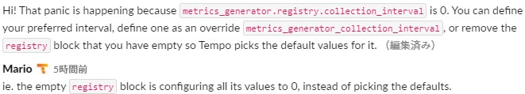
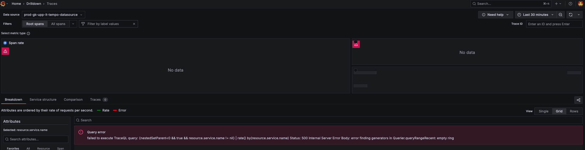

## metrics-generatorを有効にしたらTempoが起動しなくなった件
### 事象
- Tempo v2.1.1でmonolithic modeで動かして問題なかったけど、`metrics_generator`設定を追加したらpanicが起きてTempoが起動しなくなった
  - Tempo Logs  
    ~~~
    github.com/grafana/tempo/modules/generator/registry/registry.go:122 +0x9db
    created by github.com/grafana/tempo/modules/generator/registry.New
    github.com/grafana/tempo/modules/generator/registry/job.go:11 +0x4c
    github.com/grafana/tempo/modules/generator/registry.job({0x29a8920, 0xc00016e140}, 0xc001e46450, 0xc001e46460)
    time/tick.go:24 +0x10f
    time.NewTicker(0x29a8920?)
    goroutine 2376 [running]:
    panic: non-positive interval for NewTicker
    ~~~
  - Configuration  
    ~~~
    server:
      http_listen_port: 3200
      
    distributor:
      receivers:
          otlp:
            protocols:
              http:
              grpc:
      
    compactor:
      compaction:
        block_retention: 744h                # configure total trace retention here
      
    storage:
      trace:
        backend: s3
        s3:
          endpoint: s3.ap-northeast-1.amazonaws.com
          bucket: <S3 Bucket Name>
          forcepathstyle: true
          #set to true if endpoint is https
          insecure: true
        wal:
          path: /tmp/tempo/wal         # where to store the the wal locally
        local:
          path: /tmp/tempo/blocks
      
    overrides:
      metrics_generator_processors:
        - span-metrics
      
    metrics_generator:
      ring:
        kvstore:
      processor:
        service_graphs:
        span_metrics:
          intrinsic_dimensions:
          dimensions:
            - "db.statement"
      registry:
      storage:
        path: /opt/tempo/wal
        wal:
        remote_write:
          - url: <Remote Write URL>      
    ~~~

### 原因
- `metrics_generator.registry`がemptyだとその配下の項目(e.g. `collection_interval`)の設定値がdefault値になるのではなく、全部`0`が設定されるとのこと  
    

### 対処
- `registry` blockを削除するか、以下のように明示的に`registry`配下の項目を設定する  
  ~~~yaml
  metrics_generator:
      registry:
          collection_interval: 15s
          stale_duration: 15m
          max_label_name_length: 1024
          max_label_value_length: 2048
  ~~~

## GrafanaのDrildownでTrace （Tempo） を選択するとエラーが発生する件
### 事象
- GrafanaのDrilldonwでTrace (Tempo) を選択すると以下のエラーが発生する
  ```
  level=warn ts=2026-02-03T03:13:25.758261042Z caller=server.go:2294 msg="GET /querier/api/metrics/query_range?start=1770086605755779972&end=1770088432000000000&step=28s&mode=recent&blockID=&startPage=0&pagesToSearch=0&version=&encoding=&size=0&footerSize=0&q=%7BnestedSetParent%3C0+%26%26+true+%26%26+status%3Derror%7D+%7C+rate%28%29++with%28sample%3Dtrue%29&exemplars=99&maxSeries=0 (500) 79.245µs"
  ```



### 原因
- 上記のログにも出ているように、DrilldownではTempoのメトリクスクエリを実行している。しかし、デフォルトの状態ではmetricsGeneratorが無効になっており、メトリクスクエリを実行できないためエラーとなっている。**なので、metricsGeneratorを有効にする必要がある**。(metrics-generatorのPodが作成される)
- 参考URL
  - https://grafana.com/docs/tempo/latest/configuration/
  - https://grafana.com/docs/tempo/latest/metrics-from-traces/metrics-queries/configure-traceql-metrics/
  - https://github.com/grafana/tempo/issues/5491
  - https://github.com/grafana/helm-charts/tree/main/charts/tempo-distributed  
    > ## Activate metrics generator
    > Metrics-generator is disabled by default and can be activated by configuring the following values:
    > ```yaml
    > metricsGenerator:
    >   enabled: true
    >   replicas: 2
    >   config:
    >     storage:
    >       remote_write:
    >       - url: http://cortex/api/v1/push
    >         send_exemplars: true
    >    #    headers:
    >    #      x-scope-orgid: operations
    > # Global overrides
    > overrides:
    >   defaults:
    >     metrics_generator:
    >       processors:
    >         - service-graphs
    >         - span-metrics

### 対処
- `metricsGenerator`を有効にし、`registry`と`storage`の設定を追加する。以下はCortex-tenantにRemote Writeする例。あと、`overrides`でprocessorsを指定するのも忘れずに。  
  ```yaml
  tempo:
    iamge:
      ・・・

  metricsGenerator:
    enabled: true
    config:
      registry:
        collection_interval: 30s
        external_labels:
          source: tempo
        inject_tenant_id_as: tenant # Tenant IDが「tenant」ラベルに設定される
      storage:
        path: /var/tempo/wal
        remote_write:
          - url: http://cortex-tenant.monitoring.svc:8080/push # Cortex-tenant側で
            send_exemplars: true
        remote_write_add_org_id_header: true

  overrides:
    defaults:
      metrics_generator:
        processors:
          - service-graphs
          - span-metrics
          - local-blocks # Grafana DrillDownが内部で使う TraceQL metrics クエリ（rate(), count_over_time() 等）には local-blocks が必須
  ```

> [!IMPORTANT]  
> - Tempoがマルチテナントモードの場合、`remote_write_add_org_id_header: true`を設定すると、Headerに`X-Scope-OrgID`が追加される
> - ただ、Remote Write先がThanosなど、テナントを識別するHeader名が異なる場合は、`inject_tenant_id_as`でテナント識別用のラベルを指定した上で、Remote Write先としてcortex-tenantを指定して、cortex-tenant側でそのラベルを元にThanos用のHeaderに変換するように設定する必要がある