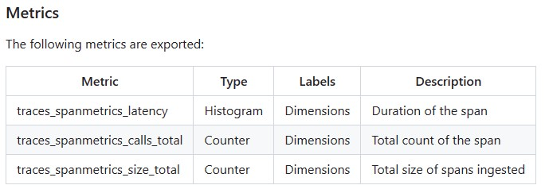
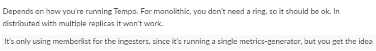

## Metrics-generatorとは
- https://grafana.com/docs/tempo/latest/metrics-generator/
- Trace/Spanからメトリクスを生成し、Remote WriteでPrometheusもしくはAMPやVictoriMetrics等の長期保存ツールに送る
  > Metrics-generator is an optional Tempo component that derives metrics from ingested traces. If present, the distributor will write received spans to both the ingester and the metrics-generator. The metrics-generator processes spans and writes metrics to a Prometheus data source using the Prometheus remote write protocol.
- `Service graphs`と`Span metrics`の2種類がある

### Service graphs
- https://grafana.com/docs/tempo/latest/metrics-generator/service_graphs/
- https://grafana.com/docs/tempo/latest/metrics-generator/service-graph-view/
> Service graphs are the representations of the relationships between services within a distributed system.

### Span metrics
- OpenTelemetryの[`Span Metrics Connector`](https://github.com/open-telemetry/opentelemetry-collector-contrib/blob/main/connector/spanmetricsconnector/README.md)のミラー
- Tempoのspan_metricsに関するURL
  - https://grafana.com/docs/tempo/latest/metrics-generator/span_metrics/
  - https://github.com/grafana/tempo/blob/main/docs/sources/tempo/metrics-generator/span_metrics.md

- span_metricsで取得されるメトリクス
  

- **TempoでAttributesとして表示される項目をすべてメトリクスに変換することができる**
  - `db.statement`というAttributesの値をもとにメトリクスを生成する設定例  
    → `db.statement`の種類分、メトリクスのLabelが作成される
    ~~~yaml
    metrics_generator:
      ring:
        kvstore:
      processor:
        service_graphs:
        span_metrics:
          intrinsic_dimensions:
          dimensions:
            - "db.statement"
    ~~~

- **exemplarsは自動で追加される**
  - https://grafana.com/docs/tempo/latest/metrics-generator/span_metrics/#generate-metrics-from-spans
    > Last but not least, span metrics lower the entry barrier for using exemplars. An exemplar is a specific trace representative of measurement taken in a given time interval. Since traces and metrics co-exist in the metrics-generator, exemplars can be automatically added, providing additional value to these metrics.

- monolithic modeではSpan metricsにringは不要
  

- distributed-modeの設定例
  - https://github.com/grafana/tempo/blob/main/example/docker-compose/distributed/tempo-distributed.yaml
