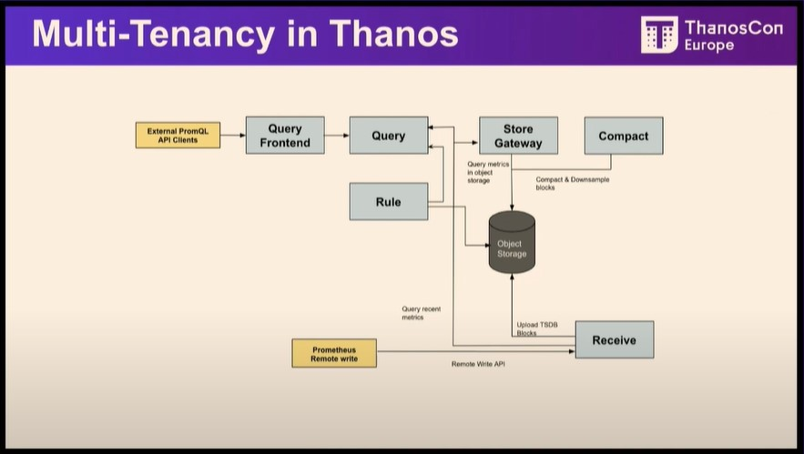
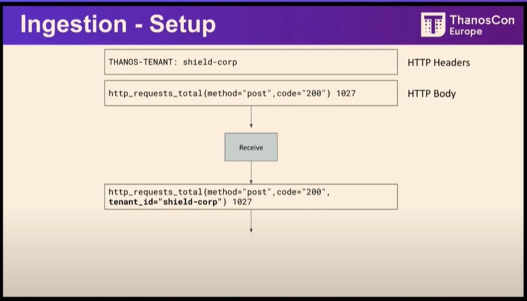
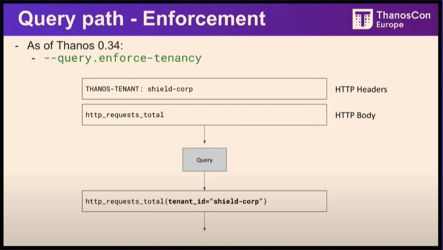
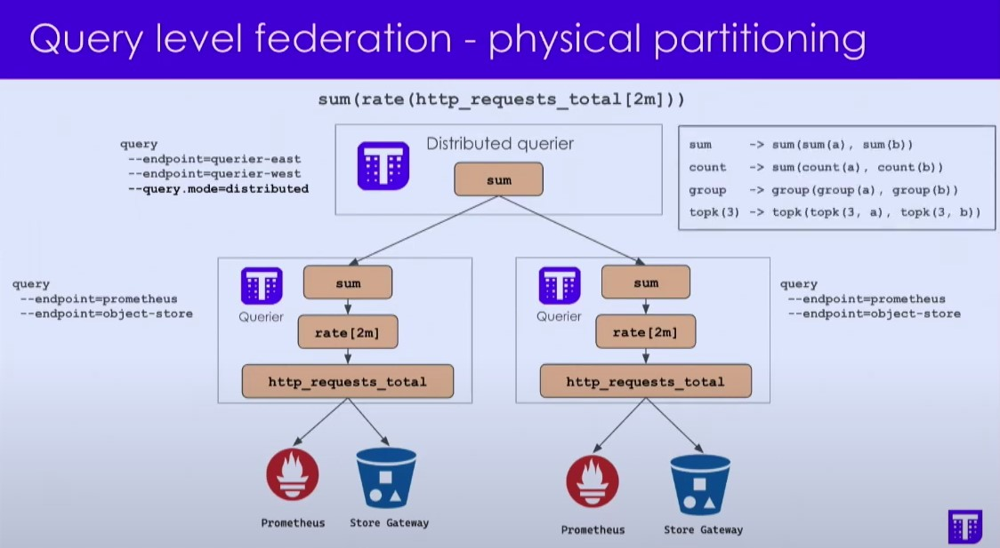
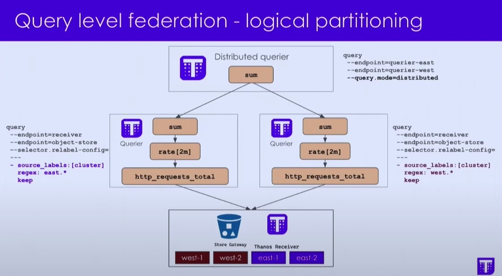
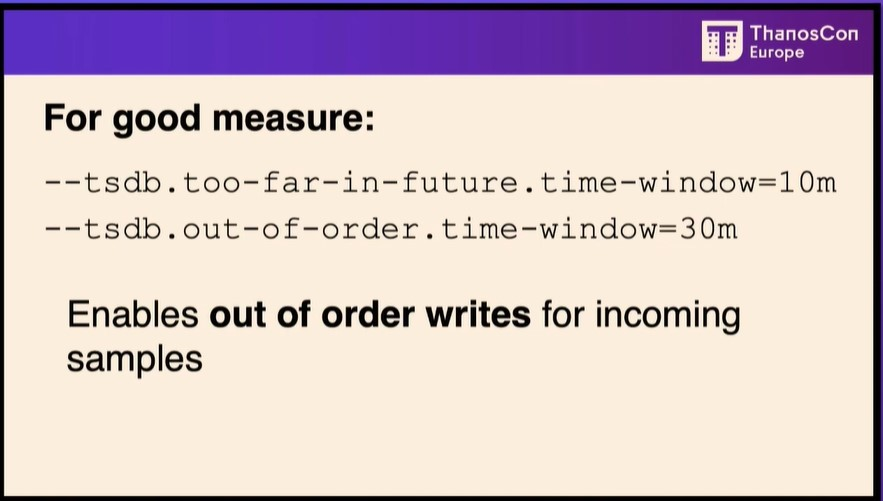
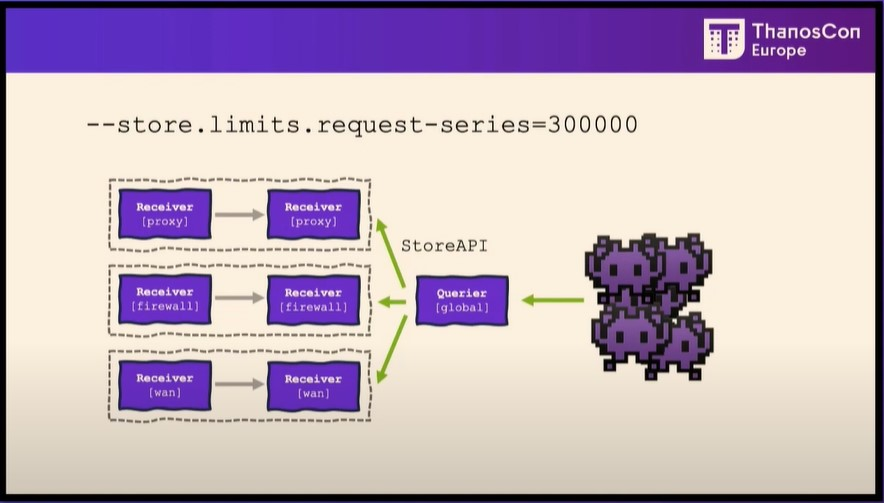
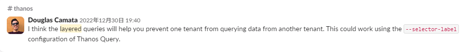

- `Receiver`を使う方式と`Sidecar`を使う方式がある
  - 一般的にはMulti Tenancyのために`Receiver`を使うところが多い

# Receiverを使う方式
### アーキテクチャ
  
※https://thanos.io/v0.8/proposals/201812_thanos-remote-receive/

### ingestion
- **Receiverは自動的にingestionされるデータにあるHTTPヘッダーの`THANOS-TENANT`の値を、`tenant_id`というラベルに変換して保存する**
  - **https://www.youtube.com/watch?v=SAyPQ2d8v4Q**  
  
### query
- **Querier(Query)実行時、`--query.enforce-tenancy`フラグを付けて実行すると、HTTPヘッダーの`THANOS-TENANT`の値を、`tenant_id`というラベルの値に変換/挿入してクエリーを投げてくれる**  
  
- `--query.enforce-tenancy`フラグをつけないと、Grafanaなどで`THANOS-TENANT`ヘッダーを設定してもすべてのテナント(`tenant_id`ラベル)のメトリクスが参照できてしまう
- 逆にQuerier(Query)を`--query.enforce-tenancy`フラグを付けて実行している場合、Grafanaで`THANOS-TENANT`ヘッダーを設定しないと何のデータも見れない

## 後で詳しく確認！
- https://www.youtube.com/watch?v=E8L8fuRj66o&list=PLj6h78yzYM2M0QzJhgCdGVuEhx8OlXpvX&index=6  
  
  

