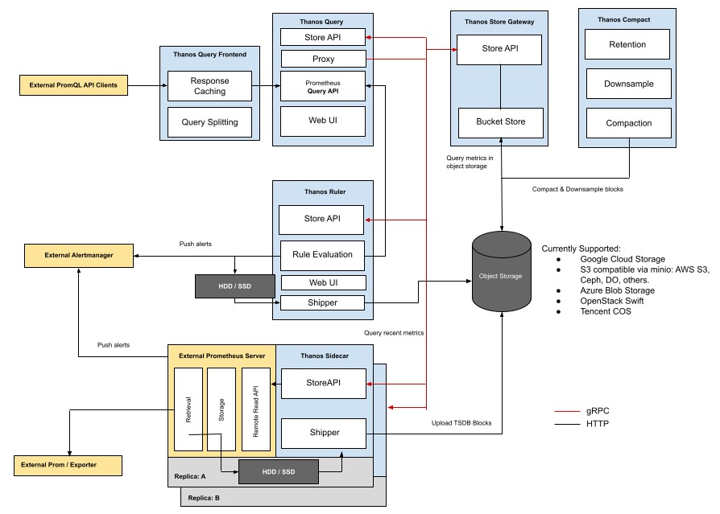
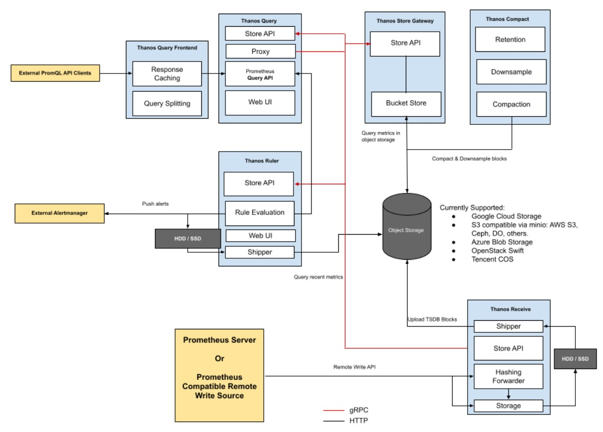
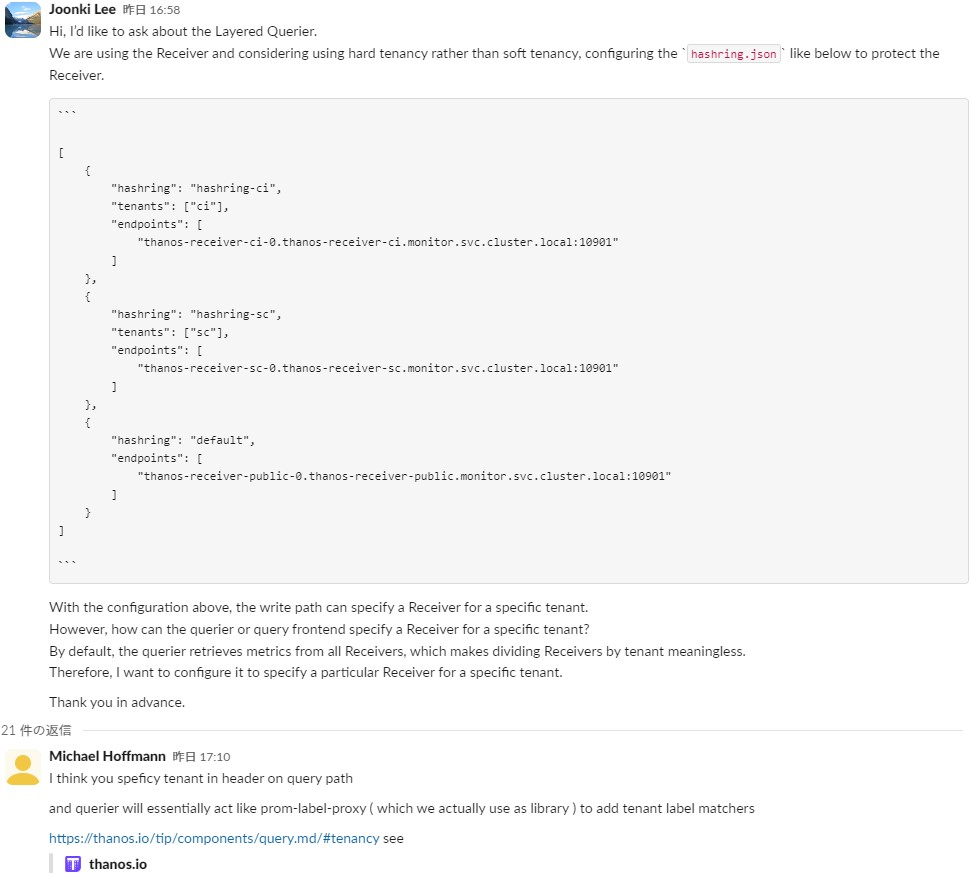
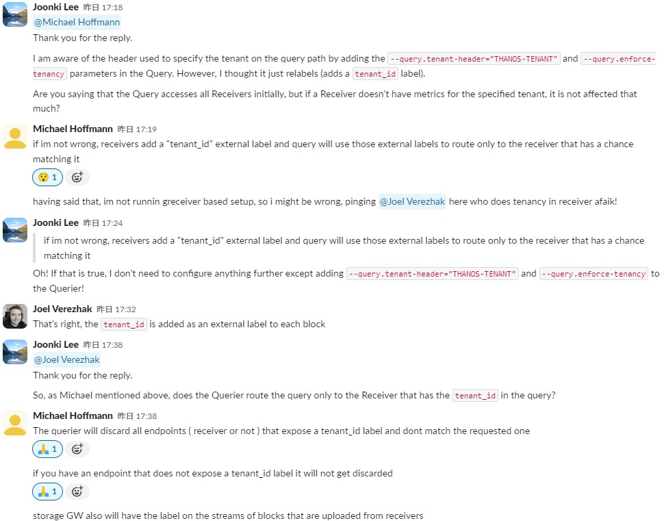
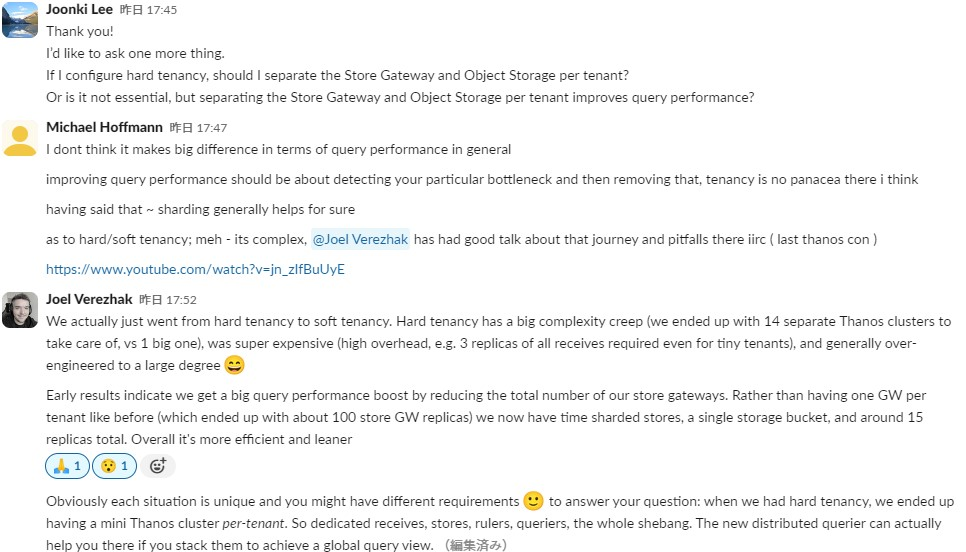
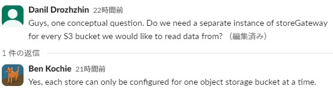
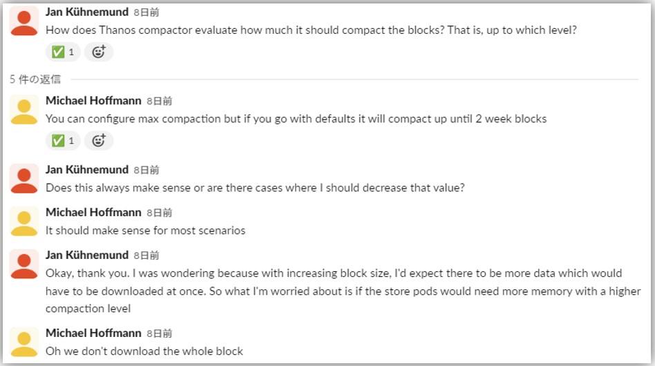
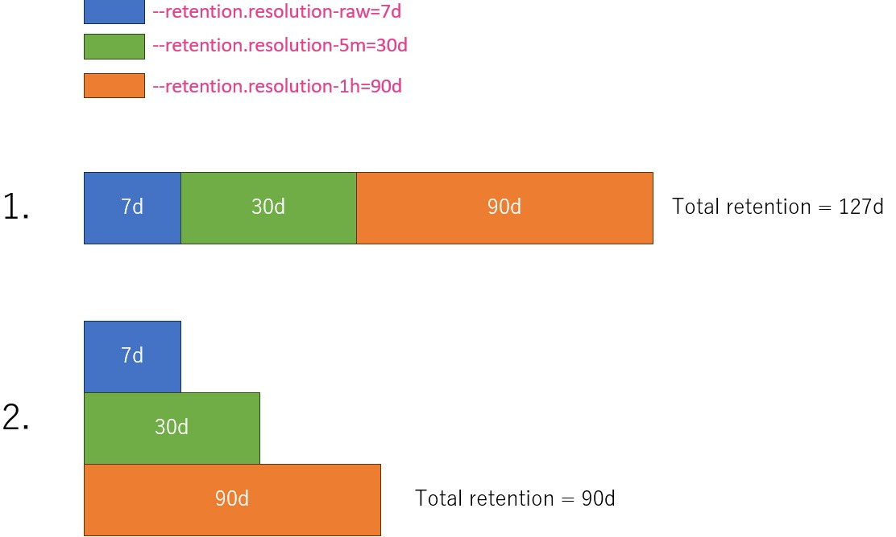

<!-- TOC -->

- [アーキテクチャ](#アーキテクチャ)
- [Multi Tenancy](#multi-tenancy)
- [Sidecar](#sidecar)
- [Receiver](#receiver)
  - [routing receiversとingesting receiversの分離](#routing-receiversとingesting-receiversの分離)
    - [routing receiversとingesting receiversの分離時の設定に関する注意事項](#routing-receiversとingesting-receiversの分離時の設定に関する注意事項)
  - [`--receive.replication-factor`について](#--receivereplication-factorについて)
  - [hashringについて](#hashringについて)
  - [読み込み(Query Path)における対象（e.g. テナント）のReceiverとStore Gatewayの選別について](#読み込みquery-pathにおける対象eg-テナントのreceiverとstore-gatewayの選別について)
- [Store (Store Gateway)](#store-store-gateway)
- [Querier (Query)](#querier-query)
- [Query Frontend](#query-frontend)
  - [`max_idle_conns_per_host`について](#max_idle_conns_per_hostについて)
- [Compactor](#compactor)
  - [compaction group](#compaction-group)
  - [DownSamplingについて](#downsamplingについて)
    - [`--retention.resolution-raw`、`--retention.resolution-5m`、`--retention.resolution-1h`について](#--retentionresolution-raw--retentionresolution-5m--retentionresolution-1hについて)
  - [Compactor内の`meta.json`について](#compactor内のmetajsonについて)
  - [Compactor トラブルシューティング](#compactor-トラブルシューティング)
    - [Overlaps](#overlaps)
- [Ruler](#ruler)
- [Store API](#store-api)

<!-- /TOC -->
<!-- /TOC -->

# アーキテクチャ
- Sidecar方式  
  

- Receiver方式  
  

# Multi Tenancy
- https://thanos.io/tip/operating/multi-tenancy.md/
- **Thanosは色んなところでPrometheusの`global.external_labels`を使ってPrometheusインスタンスを識別するため、Prometheus側の`global.external_labels`の設定は必須である**
  - https://thanos.io/tip/thanos/quick-tutorial.md/#external-labels

# Sidecar
- https://thanos.io/tip/components/sidecar.md/
- PrometheusコンテナのSidecarコンテナとして起動され、定期的に (defaultでは2時間ごと) PrometheusのメトリクスをObject Storageに送信する
  - **Object Storageに送られる前にPrometheusがcrashすると直近のメトリクスデータがなくなるので、PV付きでPrometheusを実行すること！**
- Store APIも実装されており、オブジェクトストレージに送信されてない直近のメトリクスについてPrometheusにクエリーを投げる
- **`--storage.tsdb.min-block-duration`と`--storage.tsdb.max-block-duration`は必ず同じ値を設定しなければいけない。デフォルトでは`2h`が設定されていて、これが推奨値でもある。**  
  > The `--storage.tsdb.min-block-duration` and `--storage.tsdb.max-block-duration` must be set to equal values to disable local compaction in order to use Thanos sidecar upload, otherwise leave local compaction on if sidecar just exposes StoreAPI and your retention is normal. The default of 2h is recommended. Mentioned parameters set to equal values disable the internal Prometheus compaction, which is needed to avoid the corruption of uploaded data when Thanos compactor does its job, this is critical for data consistency and should not be ignored if you plan to use Thanos compactor. Even though you set mentioned parameters equal, you might observe Prometheus internal metric `prometheus_tsdb_compactions_total` being incremented, don’t be confused by that: Prometheus writes initial head block to filesystem via its internal compaction mechanism, but if you have followed recommendations - data won’t be modified by Prometheus before the sidecar uploads it. Thanos sidecar will also check sanity of the flags set to Prometheus on the startup and log errors or warning if they have been configured improperly
- Prometheusのメトリクスデータ保持期間は`min-block-duration`の3倍以上(6h以上)にすることが推奨されている
  - Object Storageの障害に備えて
- Thanos Sidecarに強制的にObject StorageにflushするようなAPIはない
  - https://github.com/thanos-io/thanos/issues/1849

# Receiver
- https://thanos.io/v0.8/proposals/201812_thanos-remote-receive/
- ReceiverもPrometheusと同様に２時間ごとにObject Storageにブロックをアップロードする
  - https://medium.com/@appareddy.prabha/configuring-thanos-receiver-a-step-by-step-guide-for-long-term-storage-in-prometheus-3f2b487accab
- Receiverの`--tsdb.retention`とPrometheusの`--tsdb.retention`フラグの意味合いが異なる。Prometheusではデータの保持期間を意味するけど、Thanosでは指定した期間中新しいデータがない場合、そのテナントがもう存在しないとdecommissionする？
  > A Receiver will automatically decommission a tenant once new samples have not been seen for longer than the `--tsdb.retention` period configured for the Receiver. The tenant decommission process includes flushing all in-memory samples for that tenant to disk, sending all unsent blocks to S3, and removing the tenant TSDB from the filesystem. If a tenant receives new samples after being decommissioned, a new TSDB will be created for the tenant.
  >
  > **Note that because of the built-in decommissioning process, the semantic of the `--tsdb.retention` flag in the Receiver is different than the one in Prometheus. For Receivers, `--tsdb.retention=t` indicates that the data for a tenant will be kept for `t` amount of time, whereas in Prometheus, `--tsdb.retention=t` denotes that the last `t` duration of data will be maintained in TSDB. In other words, Prometheus will keep the last `t` duration of data even when it stops getting new samples.**
- `--label`(external label)フラグは必須。ないと以下のエラーが出て起動に失敗する。
  ```shell
  level=error err="no external labels configured for receive, uniquely identifying external labels must be configured (ideally with `receive_` prefix); see https://thanos.io/tip/thanos/storage.md#external-labels for details.
  ```
- ReceiverではPrometheusに設定されているexternal labelが、複数のPrometheusからのデータを区別するためにThanosが認識するexternal labelには反映されない。  
  **①Receiverに設定する`--label`フラグ、②Receiverに連携される`THANOS-TENANT`ヘッダー、この２つのみがThanosが認識するexternal labelとして設定される。**  
  Store GatewayやCompactor内部で確認できる`meta.json`ファイルの`thanos.labels`フィールドでThanosが認識しているexternal labelsを確認できる。

## routing receiversとingesting receiversの分離
- https://thanos.io/tip/proposals-accepted/202012-receive-split.md/
  > This allows setting optional deployment model were only routing receivers are using hashring files and does the routing and replication. That allows ingesting receivers to not handle any routing or hashring, only receiving multi tenant writes.

- *routing receivers*はstatelessでデータの保存は行わず、hashingと*ingesting receivers*にforward/replicateするだけ
  - **Receiverを`--receive.local-endpoint`フラグなし ＋ hashring関連設定(e.g. `--receive.hashrings`フラグ)ありで実行すると*routing receivers*になる**
  - **Receiverを`--receive.local-endpoint`フラグあり ＋ hashring関連設定(e.g. `--receive.hashrings`フラグ)なしで実行すると*ingesting receivers*になる**
- *ingesting receivers*にテナントごとにサブディレクトリが作成されて、その中にchunk, index, walなどが格納される  
  ```shell
  /tmp/thanos/receive $ ls -l
  total 8
  drwxrws---    9 thanos   thanos        4096 Apr 26 18:34 test1
  drwxrwsr-x    8 thanos   thanos        4096 Apr 26 18:34 test2
  /tmp/thanos/receive $
  /tmp/thanos/receive $ ls -l test1/
  total 44
  drwxrwsr-x    3 thanos   thanos        4096 Apr 26 17:09 01HWDP4D73RT872F43CMXYZYCA
  drwxrwsr-x    3 thanos   thanos        4096 Apr 26 17:26 01HWDQ3Y8FQNZNEJJ7WKSVA89R
  drwxrwsr-x    3 thanos   thanos        4096 Apr 26 17:31 01HWDQCAMYD1E27285B2XZB7TR
  drwxrwsr-x    2 thanos   thanos        4096 Apr 26 18:00 chunks_head
  -rw-r--r--    1 thanos   thanos           0 Apr 26 17:31 lock
  drwxrws---    2 root     thanos       16384 Apr 24 17:43 lost+found
  drwxrws---    3 thanos   thanos        4096 Apr 26 17:09 thanos
  -rw-r--r--    1 thanos   thanos         132 Apr 26 18:34 thanos.shipper.json
  drwxrwsr-x    3 thanos   thanos        4096 Apr 26 17:31 wal
  /tmp/thanos/receive $
  /tmp/thanos/receive $ ls -l test2/
  total 28
  drwxrwsr-x    3 thanos   thanos        4096 Apr 26 17:09 01HWDP4D6XVYRWD1WR0MHZECVD
  drwxrwsr-x    3 thanos   thanos        4096 Apr 26 17:26 01HWDQ3Y8FMW3WK44QFBKT8BEF
  drwxrwsr-x    3 thanos   thanos        4096 Apr 26 17:31 01HWDQCAMYV3BXRC1P9AV7XS1S
  drwxrwsr-x    2 thanos   thanos        4096 Apr 26 18:00 chunks_head
  -rw-r--r--    1 thanos   thanos           0 Apr 26 17:31 lock
  drwxrws---    3 thanos   thanos        4096 Apr 26 17:01 thanos
  -rw-r--r--    1 thanos   thanos         132 Apr 26 18:34 thanos.shipper.json
  drwxrwsr-x    3 thanos   thanos        4096 Apr 26 17:31 wal
  /tmp/thanos/receive $
  ```

### routing receiversとingesting receiversの分離時の設定に関する注意事項
- **`--receive.hashrings-file`(もしくは`--receive.hashrings`)はrouting receiversにのみ設定！**
  - `--receive.hashrings-file`と`--receive.local-endpoint`の両方のパラメータを指定するとrouting receivers兼ingesting receiversになる
  - [関連するソースコード](https://github.com/nutslove/thanos/blob/main/cmd/thanos/receive.go#L985)  
    ```go
    func (rc *receiveConfig) determineMode() receive.ReceiverMode {
    	// Has the user provided some kind of hashring configuration?
    	hashringSpecified := rc.hashringsFileContent != "" || rc.hashringsFilePath != ""
    	// Has the user specified the --receive.local-endpoint flag?
    	localEndpointSpecified := rc.endpoint != ""

    	switch {
    	case hashringSpecified && localEndpointSpecified:
    		return receive.RouterIngestor
    	case hashringSpecified && !localEndpointSpecified:
    		// Be careful - if the hashring contains an address that routes to itself and does not specify a local
    		// endpoint - you've just created an infinite loop / fork bomb :)
    		return receive.RouterOnly
    	default:
    		// hashring configuration has not been provided so we ingest all metrics locally.
    		return receive.IngestorOnly
    	}
    }
    ```
- **`--receive.replication-factor`パラメータは routing-receiver にのみ指定！**

## `--receive.replication-factor`について
- https://thanos.io/v0.8/proposals/201812_thanos-remote-receive/
- If any time-series in a write request received by a Thanos receiver is not successfully written to at least *(REPLICATION_FACTOR + 1)/2* nodes, the receiver responds with an error. For example, to attempt to store 3 copies of every time-series and ensure that every time-series is successfully written to at least 2 Thanos receivers in the target hashring, all receivers should be configured with the following flag: `--receive.replication-factor=3`
- `--receive.replication-factor`の数にはデータを受け付けたReceiverも含まれている  
   例えば`--receive.replication-factor=3`にした場合、データを受け付けたReceiverは自分以外の２つのReceiverにデータをレプリケーションする
- replicationは同じhashring内のReceiver間で行われる

## hashringについて
- Lokiとは違ってReceiver同士のhashringのconfigファイルを作成してReceiver実行時`--receive.hashrings-file`フラグとして指定する必要がある
  - 動的にhashringを管理してくれる*Receive Controller*というのもある
    - https://thanos.io/tip/components/receive.md/#hashring-management-and-autoscaling-in-kubernetes
    - https://github.com/observatorium/thanos-receive-controller
- hashはメトリクスの*label set*をinput dataとして行われる
  - つまり、メトリクスの*label set*で転送されるReceiverが決まる
- テナントごとにhashringを設定することもできる  
  **※WriteとReadでそれぞれどうやって(何を見て)対象のテナントを識別するか確認！**
  - 設定例１（複数テナント用のhashringとデフォルト(共用)のhashringを指定）  
    **ルールは上から評価されて一致するものがあるとその下のルールは評価されないため(一番上に共用のhashringを定義すると各テナント用のhashringは無視されるため)、必ずdefault(共用)のhashringは一番下に定義すること！** [関連github issue](https://github.com/thanos-io/thanos/issues/4995)
    ```yaml
    [
        {
            "hashring": "hashring-ci",
            "tenants": ["ci"],
            "endpoints": [
                "thanos-receiver-ci-0.thanos-receiver-ci.monitor.svc.cluster.local:10901"
            ]
        },
        {
            "hashring": "hashring-sc",
            "tenants": ["sc"],
            "endpoints": [
                "thanos-receiver-sc-0.thanos-receiver-sc.monitor.svc.cluster.local:10901"
            ]
        },
        {
            "hashring": "default",
            "endpoints": [
                "thanos-receiver-public-0.thanos-receiver-public.monitor.svc.cluster.local:10901"
            ]
        }
    ]
    ```
    - `tenants`フィールドでテナントが設定されているものを「*Hard Tenancy*」、`tenants`フィールドが設定されてないものを「*Soft Tenancy*」という
  - 設定例２ (正規表現でテナントを指定)  
    ```yaml
    [
        {
           "tenants": ["foo*"],
           "tenant_matcher_type": "glob",
           "endpoints": [
                "127.0.0.1:1234",
                "127.0.0.1:12345",
                "127.0.0.1:1235"
            ]
        }
    ]
    ```

## 読み込み(Query Path)における対象（e.g. テナント）のReceiverとStore Gatewayの選別について
- 書き込み(Write Path)においてテナントごとの対象Receiverは上記の`hashring.json`で指定できる
- **読み込み(Query Path)時は明示的にテナントごとのReceiverを指定しているわけではなく、ReceiverやStore GatewayにはExternal Labelを持っていて、Querierは`--endpoint`で指定したReceiverやStore GatewayやSidecarの中から対象のExternal Labelを持たないものにはクエリーを投げない。**  
  **http headerで連携した`tenant_id`ラベルは自動的にExternal Labelとして登録されるため、Hard Tenancyの場合でもQuerierに`--query.tenant-header="THANOS-TENANT"`と`--query.enforce-tenancy`のパラメータを指定して実行するだけでQuerierが自動的にクエリーに含まれている`tenant_id`ラベルを持つエンドポイント(Receiverだけではなく、Store GatewayやSidecarも)にのみリクエストを投げるので問題ない。**






# Store (Store Gateway)
- https://thanos.io/tip/components/store.md/
- Store GatewayとObject Storageは１対１の設定で、複数のObject Storageがある場合はObject Storageの数の分Store Gatewayが必要  
  
- StoreGatewayはローカルディスクをそこまで必要とせず、再起動などでデータが削除されても起動時間が増加するくらいでそこまで影響はない
  > It acts primarily as an API gateway and therefore does not need significant amounts of local disk space. It joins a Thanos cluster on startup and advertises the data it can access. It keeps a small amount of information about all remote blocks on local disk and keeps it in sync with the bucket. This data is generally safe to delete across restarts at the cost of increased startup times.
  > In general, an average of 6 MB of local disk space is required per TSDB block stored in the object storage bucket, but for high cardinality blocks with large label set it can even go up to 30MB and more. It is for the pre-computed index, which includes symbols and postings offsets as well as metadata JSON.
- Store (Store Gateway)もWeb UIを持っていて、`10902`ポート(http)からアクセス可能
  - 各Blockに関する情報を確認できる

# Querier (Query)
- https://thanos.io/tip/components/query.md/
- Querier is fully **stateless** and horizontally scalable.
- HA構成のPrometheusで収集された重複メトリクスのdeduplication(重複排除)もQuerierが行う
  - `--query.replica-label`フラグでdedupのためのラベルを指定  
    ```shell
    thanos query \
        --http-address        0.0.0.0:19192 \
        --endpoint            1.2.3.4:19090 \
        --endpoint            1.2.3.5:19090 \
        --query.replica-label replica          # Replica label for deduplication
        --query.replica-label replicaX         # Supports multiple replica labels for deduplication
    ```
    - 複数の`--query.replica-label`がある場合、**OR条件**になる
    - 複数の`--query.replica-label`が与えられた場合、Thanos Queryはこれらのラベルのうちどれか一つが一致するデータセットを同じソースからのものと見なし、それらの間でデータの重複を解消する
  - **`global.external_labels`をもとにdedupを行うので、Prometheus側で`global.external_labels`が設定されている必要がある**
  - https://thanos.io/tip/thanos/quick-tutorial.md/#deduplicating-data-from-prometheus-ha-pairs
- **以下公式サイトから抜粋**
  - **`--query.replica-label`フラグに指定したラベルはクエリー時(e.g. Grafanaから)は表示されなくなる**
  ```
  ## Deduplication 
  The query layer can deduplicate series that were collected from high-availability pairs of data sources such as Prometheus. 
  A fixed single or multiple replica labels must be chosen for the entire cluster and can then be passed to query nodes on startup.

  Two or more series that are only distinguished by the given replica label, will be merged into a single time series.
  This also hides gaps in collection of a single data source.

  ## An example with a single replica labels: 
  Prometheus + sidecar “A”: cluster=1,env=2,replica=A
  Prometheus + sidecar “B”: cluster=1,env=2,replica=B
  Prometheus + sidecar “A” in different cluster: cluster=2,env=2,replica=A
  If we configure Querier like this:

  thanos query \
      --http-address        "0.0.0.0:9090" \
      --query.replica-label "replica" \
      --endpoint            "<store-api>:<grpc-port>" \
      --endpoint            "<store-api2>:<grpc-port>" \
  And we query for metric up{job="prometheus",env="2"} with this option we will get 2 results:

  up{job="prometheus",env="2",cluster="1"} 1
  up{job="prometheus",env="2",cluster="2"} 1
  WITHOUT this replica flag (deduplication turned off), we will get 3 results:

  up{job="prometheus",env="2",cluster="1",replica="A"} 1
  up{job="prometheus",env="2",cluster="1",replica="B"} 1
  up{job="prometheus",env="2",cluster="2",replica="A"} 1
  ```

## 重複排除(Deduplication)
- https://thanos.io/tip/components/query.md/#deduplication  
  > Two or more series that are only distinguished by the given replica label, will be merged into a single time series.

# Query Frontend
- https://thanos.io/tip/components/query-frontend.md/
- Query Frontend is fully **stateless** and horizontally scalable.

## `max_idle_conns_per_host`について
- `--query-frontend.downstream-url`に1つのホスト(e.g. ロードバランサー)を指定している場合は`max_idle_conns_per_host`を100以上に設定すること！  
  > If it is pointing to a single host, most likely a load-balancer, then it is highly recommended to increase `max_idle_conns_per_host` via these parameters to at least 100 because otherwise query-frontend will not be able to leverage HTTP keep-alive connections, and the latency will be 10 - 20% higher. By default, the Go HTTP client will only keep two idle connections per each host.
- https://thanos.io/tip/components/query-frontend.md/#recommended-downstream-tripper-configuration

# Compactor
- https://thanos.io/tip/components/compact.md/
- Down Sampling、Retention、Compactionを担当するコンポーネント
- defaultではobject storage上のデータの保持期間はない(無期限保持)
- データ削除は`--retention.resolution-raw`、`--retention.resolution-5m`、`--retention.resolution-1h`の３つのフラグで設定できる。この３つを設定しなかったり`0s`に設定するとデータは無期限保存される。  
  > You can configure retention by using `--retention.resolution-raw` `--retention.resolution-5m` and `--retention.resolution-1h` flag. Not setting them or setting to 0s means no retention.
- **Retention is applied right after Compaction and Downsampling loops. If those are failing, data will never be deleted.**
- *Compaction*
  - responsible for **compacting multiple blocks into one to reduce the number of blocks and compact index indices.** We can compact an index quite well in most cases, because series usually live longer than the duration of the smallest blocks (2 hours).
  - https://thanos.io/tip/components/compact.md/#compaction
  - defaultでは２週間分まで１つのBlockにまとめる
    - https://thanos.io/tip/components/compact.md/#disk  
      > In worst case scenario compactor has to have space adequate to 2 times 2 weeks (if your maximum compaction level is 2 weeks) worth of smaller blocks to perform compaction. First, to download all of those source blocks, second to build on disk output of 2 week block composed of those smaller ones.  

      
- **Compactorは1つのObject Storageごとに1つのみ動かす必要がある**
  - https://thanos.io/tip/components/compact.md/#warning-only-one-instance-of-compactor-may-run-against-a-single-stream-of-blocks-in-a-single-object-storage
- HA構成のPrometheusからのメトリクスをCompactor側でもdedupすることができる
  - https://thanos.io/tip/components/compact.md/#vertical-compaction-use-cases
  - でもリスクがあるらしく、あまり使わない方が良さそう？
- **defaultではCompactorはcronjobとして動かせるように処理が終わったらCompletedになってしまうため、継続的に実行させるためには`--wait`と`--wait-interval=5m`フラグを付ける必要がある**
- CompactorのWeb UIを持っていて、`10902`ポート(http)からアクセス可能
  - 各Blockに関する情報を確認できる

## compaction group
- 同じPrometheusからのBlockを「*stream*」もしくは「*compaction group*」という。  
  **Compactorはこのcompaction group単位で並列でcompaction処理を行う。**  
  **compaction groupはexternal labels (Thanos (e.g. Store Gateway, Compactor) の`meta.json`の`thanos.labels`フィールドで確認できる)が同じもの**  
  **つまりCompactorはexternal labelsが同じの複数のBlock同士を１つの大きなBlockにするcompaction処理を行う。**
- 参考URL
  - https://thanos.io/tip/components/compact.md/#compaction-groups--block-streams

## DownSamplingについて
- DownSamplingの目的は**読み込みパフォーマンス向上**であり、DiskやObject Storageの容量削減ではない。**逆に`5m`と`1h`用のスペースが必要となるため、rawだけ保存するときと比べて最大３倍までストレージサイズは上がる可能性がある**  
  > The goal of downsampling is to provide an opportunity to get fast results for range queries of big time intervals like months or years.
  > 
  > Keep in mind that the initial goal of downsampling is not saving disk or object storage space. In fact, downsampling doesn’t save you any space but instead, it adds 2 more blocks for each raw block which are only slightly smaller or relatively similar size to raw blocks. This is done by internal downsampling implementation which, to ensure mathematical correctness, holds various aggregations. This means that downsampling can increase the size of your storage a bit (~3x), if you choose to store all resolutions (recommended and enabled by default).

### `--retention.resolution-raw`、`--retention.resolution-5m`、`--retention.resolution-1h`について
- 5mも1hもrawデータが必要らしい。つまり、1hダウンサンプリングに5mのデータが使われるのではなく、1hダウンサンプリングにもrawデータが使われるらしい。
  - https://www.youtube.com/watch?v=ywOriVffPZg
- データ保存のイメージは以下の **2.** になる  
    
  - クエリーに対してどの粒度のデータを取ってくるかはクエリーの期間(e.g. 1年分のメトリクス)などによって決まるっぽい

## Compactor内の`meta.json`について
- Thanos Compactorの`meta.json`はPrometheusの`meta.json`からThanosのためのmetadata(`thanos`フィールド)が追加されている
  - Store Gateway内の`meta.json`にも`thanos`フィールドがある
  - Prometheusの`meta.json`の例  
    ```json
    {
            "ulid": "01HWDEQPBGSJ2FH9J4TK94SWM8", --> 一意な識別子で、特定のTSDBブロックを識別
            "minTime": 1714132803920, --> このブロックの保持データの開始時間
            "maxTime": 1714140000000, --> このブロックの保持データの終了時間
            "stats": {
                    "numSamples": 8640, --> ブロック内のサンプル数
                    "numSeries": 36,    --> ブロック内のシリーズ数
                    "numChunks": 72     --> ぷ六区内のChunk数
            },
            "compaction": {
                    "level": 1, --> 圧縮レベル
                    "sources": [
                            "01HWDEQPBGSJ2FH9J4TK94SWM8" --> 圧縮元のブロック(ディレクトリ)
                    ]
            },
            "version": 1
    }
    ```
  - Thanos Compactorの`meta.json`の例（ **https://thanos.io/tip/thanos/storage.md/#metadata-file-metajson** ）  
    ```json
    {
            "ulid": "01HWMAEN7VNZE2M5VEH0BB6GKC",
            "minTime": 1714363200230,
            "maxTime": 1714370400000,
            "stats": {
                    "numSamples": 17280,
                    "numSeries": 72,
                    "numChunks": 144
            },
            "compaction": {
                    "level": 1,
                    "sources": [
                            "01HWMAEN7VNZE2M5VEH0BB6GKC"
                    ]
            },
            "version": 1,
            "thanos": { --> これの配下がthanosで追加されたメタデータ
                    "labels": { --> External Labels for block
                            "env": "poc",
                            "tenant_id": "test1"
                    },
                    "downsample": { 
                            "resolution": 0 --> ダウンサンプルされたデータの解像度。0はダウンサンプリングされてないことを意味する。ダウンサンプリングされている場合は5mや1hの値が入る(らしい)
                    },
                    "source": "receive", --> ブロックがどのThanosコンポーネントによって生成されたかを示す(sidecarから生成された場合はsidecarが入る)
                    "segment_files": [
                            "000001"
                    ],
                    "files": [
                            {
                                    "rel_path": "chunks/000001",
                                    "size_bytes": 27221
                            },
                            {
                                    "rel_path": "index",
                                    "size_bytes": 9462
                            },
                            {
                                    "rel_path": "meta.json"
                            }
                    ],
                    "index_stats": {}
            }
    }
    ```

## Compactor トラブルシューティング
- 参考URL
  - https://thanos.io/tip/operating/compactor-backlog.md/
  - https://thanos.io/tip/operating/troubleshooting.md/#overlaps
- **Compactorでhalt(halting)が発生するとcompactionとdownsampling処理がすべて止まってしまう**  
  > If compactors halt, any compaction or downsample process stops so it is crucial to make sure no halt happens for compactor deployment.
  > **`thanos_compact_halted`** metric will be set to 1 when halt happens. You can also find logs like below, telling that compactor is halting.
  >
  > `msg="critical error detected; halting" err="compaction failed: compaction: pre compaction overlap check: overlaps found while gathering blocks. [mint: 1555128000000, maxt: 1555135200000, range: 2h0m0s, blocks: 2]: <ulid: 01D94ZRM050JQK6NDYNVBNR6WQ, mint: 1555128000000, maxt: 1555135200000, range: 2h0m0s>, <ulid: 01D8AQXTF2X914S419TYTD4P5B, mint: 1555128000000, maxt: 1555135200000, range: 2h0m0s>`
  > There could be different reasons that caused the compactor to halt. A very common case is overlapping blocks. Please refer to our doc **https://thanos.io/tip/operating/troubleshooting.md/#overlaps** for more information.
### Overlaps
- *Block overlap*とは  
  > Set of blocks with exactly the same external labels in meta.json and for the same time or overlapping time period.
  - meta.jsonの`thanos.labels`のExternal labelsと`minTime`,`maxTime`がすべて同じのBlockが複数あること
- なぜBlock overlapが発生するのか？
  - Receiverでレプリケーション（`--receive.replication-factor=2`以上）を使うと、**同じメトリクスが複数のReceiverに書き込まれるため**
- Thanosはoverlapped blocksが絶対出ないようにデザインされていて、overlapped blocksはunexpected incidentと見なしてoverlapped blocksに対してautomatic repairを実装してない。  
  なのでBlock overlapが発生した場合はCompactorはHALT or crashし、手動で解決しなければいけない。

> [!NOTE]  
  > - `--compact.enable-vertical-compaction=true`だけではhaltしない。ただ、haltはしないだけで異なるreplicaラベルを持つブロックは別のGroupKeyのままマージされない 
  > - 適切にマージするには`--deduplication.replica-label=receiver`の設定が必要
  > - `--deduplication.replica-label`を設定すると`--compact.enable-vertical-compaction`は自動的に有効になる     

#### Block overlapを防ぐ方法
##### 前提
- **Receiver構成の場合、CompactorはPrometheusのExternal labelsをcompaction groupに使わない(`tenant_id`とreceiverの`--label`フラグのみを使う)ため、`replication-factor`を２以上にした場合、同じExternal LabelのReceiver間で同じデータを持ち、Object Storageにアップロードされるため、Block overlapが発生する。**  
##### 1. Receiverの`--label`にPod名など、各Receiverが異なるExternal labelsを持つようにする
- **それを防ぐために以下のように(ingesting)receiverの`--label`にPod名が入るようにして各Receiverが異なるExternal labelsを持つようにする必要がある**  
  ```yaml
  apiVersion: apps/v1
  kind: StatefulSet
  metadata:
    name: thanos-ingesting-receiver
  spec:
    replicas: 3
    selector:
      matchLabels:
        app: thanos-ingesting-receiver
    serviceName: thanos-ingesting-receiver
    template:
      metadata:
        labels:
          app: thanos-ingesting-receiver
      spec:
        securityContext:
          fsGroup: 1001
        containers:
        - name: thanos-ingesting-receiver
          image: quay.io/thanos/thanos:v0.34.1
          args:
          - receive
          - --grpc-address=0.0.0.0:10901
          - --http-address=0.0.0.0:10902
          - --remote-write.address=0.0.0.0:19291
          - --receive.local-endpoint=127.0.0.1:10901
          - --receive.tenant-header=THANOS-TENANT
          - --receive.default-tenant-id=test1
          - --tsdb.path=/tmp/thanos/receive
          - --label=env="poc"
          - --label=receiver="$(MY_POD_NAME)" ★ statefulsetのpod名(e.g. receiver-0)が入り、各receiverが異なるExternal labelsを持つようになる
          - --tsdb.retention=1d
          - --objstore.config-file=/etc/thanos/object-store.yaml
          env:
          - name: MY_POD_NAME
            valueFrom:
              fieldRef:
                fieldPath: metadata.name
            ・
            ・
  ```
  - https://thanos.io/tip/operating/troubleshooting.md/#overlaps  
    > 2 Prometheus instances are misconfigured and they are uploading the data with exactly the same external labels. This is wrong, they should be unique.

##### 2. CompactorでVertical Compactionを有効にする
> [!NOTE]  
> Vertical Compactionはクエリー時に重複排除するのではなく、Object Storage上のデータを直接重複排除するもの

- https://thanos.io/tip/components/compact.md/#vertical-compactions
- Vertical Compactionは、Compactorの`--compact.enable-vertical-compaction`フラグを`true`に設定することで有効になる。defaultは`false`。
- `--deduplication.replica-label`フラグはVertical Compaction専用のもの  
  > If you want to “virtually” group blocks differently for deduplication use cases, use `--deduplication.replica-label=LABEL` to set one or more labels to be ignored during block loading.
  > 
  > For example if you have following set of block streams:
  > ```
  > external_labels: {cluster="eu1", replica="1", receive="true", environment="production"}
  > external_labels: {cluster="eu1", replica="2", receive="true", environment="production"}
  > external_labels: {cluster="us1", replica="1", receive="true", environment="production"}
  > external_labels: {cluster="us1", replica="1", receive="true", environment="staging"}
  > ```
  > and set `--deduplication.replica-label=replica`, Compactor will assume those as:
  > ```
  > external_labels: {cluster="eu1", receive="true", environment="production"} (2 streams, resulted in one)
  > external_labels: {cluster="us1", receive="true", environment="production"}
  > external_labels: {cluster="us1", receive="true", environment="staging"}
  > ```

##### QuerierとCompactorの使い分け
| 項目 | Querierで重複排除 | Compactorで重複排除 |
|------|------------------|-------------------|
| フラグ | `--query.replica-label` | `--deduplication.replica-label` |
| 処理タイミング | クエリ時（リアルタイム） | コンパクション時（バッチ） |
| ストレージ上のデータ | 重複が残る | マージされて1つになる |
| ストレージ容量 | 多い（N倍） | 削減される |
| 可逆性 | ✅ いつでも変更可能 | ❌ 不可逆 |

**推奨**: 通常はQuerierの`--query.replica-label`だけで十分。ストレージ容量削減が必要な場合のみCompactorを検討。

> [!WARNING]  
> Compactorでのマージは**不可逆**。マージ後はreplicaラベルが削除され、特定Receiverのデータだけをクエリできなくなる。 

# Ruler
- Alert/Recording Ruleのためのコンポネント
- Recording Ruleによって新しく生成されたメトリクスは、Prometheusと同様にRulerのローカルディスク(HDD/SSD)に２時間間隔でTSDB blockで生成されて、Object Storageにアップロードされる
  - RulerにもStore APIが実装されていて、まだObject StorageにアップロードされてないメトリクスについてQuerierからクエリーを受け付ける
- 参考URL
  - https://thanos.io/tip/components/rule.md/

# Store API
- Thanosコンポーネント間でメトリクスデータを取得するための標準化された/gRPCで実装されているAPIインターフェース
> StoreAPI is a common proto interface for gRPC component that can connect to Querier in order to fetch the metric series. Natively Thanos implements Sidecar (local Prometheus data), Ruler and Store gateway. This solves fetching series from Prometheus or Prometheus TSDB format
- 参考URL
  - https://thanos.io/tip/thanos/integrations.md/#storeapi
  - https://thanos.io/tip/thanos/quick-tutorial.md/#store-api