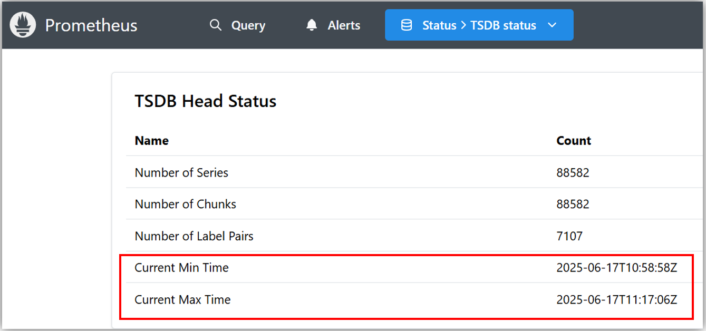

- 参考ページ
  - https://thanos.io/tip/operating/troubleshooting.md/

# Receiver `Error on ingesting samples that are too old or are too far into the future`エラー

### 事象
- ingesting-receiverの方で以下のようなエラーが出て、メトリクスがdropされる  
  ```shell
  ts=2025-06-17T09:17:14.227933068Z caller=writer_errors.go:142 level=warn component=receive component=receive-writer tenant=plat msg="Error on ingesting samples that are too old or are too far into the future" numDropped=499
  ```
### 原因
- いくつか原因があり得るっぽい

#### 1. Remote WriteするPrometheusと受け取るThanos側でTimeがsyncされてない場合
- PrometheusのUIでTSDB StatusでMin/Max Timeがすごい過去/未来の時刻になってないか確認  
  
- PrometheusとThanosのTimeを同期させる必要がある

#### 2. PrometheusもしくはThanosが一定期間の障害から復旧された場合
- 復活したタイミングで、溜まっていた古いメトリクスを連携されて、Thanosが受け付けれるデータの範囲を超えてエラーになる
- 色々調べても明確な解決策はないように見える
  - Prometheus側で古いメトリクスを削除する？
- 一応ThanosのReceiver側で`--tsdb.out-of-order.time-window`、`--tsdb.out-of-order.time-window`フラグ（defaultでは無効になっている）で未来/過去のデータを受け付けるように設定することもできる
  - https://thanos.io/tip/components/receive.md/  
    > - `--tsdb.too-far-in-future.time-window=0s`  
    >   - Configures the allowed time window for ingesting samples too far in the future.  
    >   Disabled (0s) by default. Please note enable this flag will reject samples in the future of receive local NTP time + configured duration due to clock skew in remote write clients.
    > - `--tsdb.out-of-order.time-window=0s`
    >   - [EXPERIMENTAL] Configures the allowed time window for ingestion of out-of-order samples.  
    >     Disabled (0s) by default.  
    >     **Please note if you enable this option and you use compactor, make sure you have the `--compact.enable-vertical-compaction` flag enabled, otherwise you might risk compactor halt.**
  - https://groups.google.com/g/prometheus-users/c/vtmeo06pxiE?pli=1

#### 3. Ingesting ReceiverのPV(EBS)の空き容量がなくなった場合
- Ingesting Receiverから以下のようなログが出る。ただ、必要最低限のReceiverが正常に動いていればメトリクスの受信はできる。  
  ```shell
  ts=2025-06-12T05:43:12.633036106Z caller=receive.go:665 level=error component=receive err="compact head: persist head block: mkdir /tmp/thanos/receive/unknown/01JXHAKTZR7NKFSPMQCGD2AT13.tmp-for-creation: no space left on device" msg="failed to flush storage"
  ts=2025-06-12T05:43:12.633062461Z caller=multitsdb.go:432 level=info component=receive component=multi-tsdb msg="closing TSDB" tenant=unknown
  ts=2025-06-12T05:43:12.635902998Z caller=receive.go:673 level=info component=receive msg="storage is closed"
  ts=2025-06-12T05:43:12.635973381Z caller=http.go:92 level=info component=receive service=http/server component=receive msg="internal server is shutting down" err="opening storage: open /tmp/thanos/receive/s000128/wal/00000286: no space left on device"
  ts=2025-06-12T05:43:12.636208934Z caller=shipper.go:337 level=warn component=receive component=multi-tsdb tenant=unknown msg="updating meta file failed" err="write /tmp/thanos/receive/unknown/thanos.shipper.json.tmp: no space left on device"
  ts=2025-06-12T05:43:12.636291969Z caller=shipper.go:337 level=warn component=receive component=multi-tsdb tenant=unknown msg="updating meta file failed" err="write /tmp/thanos/receive/unknown/thanos.shipper.json.tmp: no space left on device"
  ```
> [!CAUTION]  
> 上記のエラーは空き容量がなくなったときに数回出て、その後は何もログが出ないのでご注意

- Thanosが上記の状態になってメトリクスを受け付けれない状態でも、Thanos側では何もログが出ず、Prometheus側では以下のような503エラーログしか確認できない  
  ```shell
  time=2025-06-17T09:15:18.698Z level=WARN source=queue_manager.go:2031 msg="Failed to send batch, retrying" component=remote remote_name=6c1ca9 url=http://thanos-routing-receiver.monitoring.svc:19291/api/v1/receive err="server returned HTTP status 503 Service Unavailable: 3 errors: forwarding request to endpoint {thanos-ingesting-receiver-0.thanos-ingesting-receiver.monitoring.svc.cluster.local:10901 thanos-ingesting-receiver-0.thanos-ingesting-receiver.monitoring.svc.cluster.local:19391 }: rpc error: code = Unavailable desc = connection error: desc = \"transport: Error while dialing: dial tcp 10.1.24.111:10901: connect: connection refused\"; forwarding request to endpoint {thanos-ingesting-receiver-1.thanos-ingesting-receiver.monitoring.svc.cluster.local:10901 thanos-ingesting-receiver-1.thanos-ingesting-receiver.monitoring.svc.cluster.local:19391 }: rpc error: code = Unavailable desc = connection error: desc = \"transport: Error while dialing: dial tcp 10.1.27.68:10901: connect: connection refused\"; forwarding request to endpoint {thanos-ingesting-receiver-3.thanos-ingesting-receiver.monitoring.svc.cluster.local:10901 thanos-ingesting-receiver-3.thanos-ingesting-receiver.monitoring.svc.cluster.local:19391 }: rpc error: code = Unavailable desc = connection error: desc = \"transpo"
  ```

- Pod,PVを削除してPVの容量を増やした後、Podを再デプロイする
- **以下のPromQLでPVの使用率を監視すること！**
  - `(kubelet_volume_stats_used_bytes / kubelet_volume_stats_capacity_bytes) * 100`