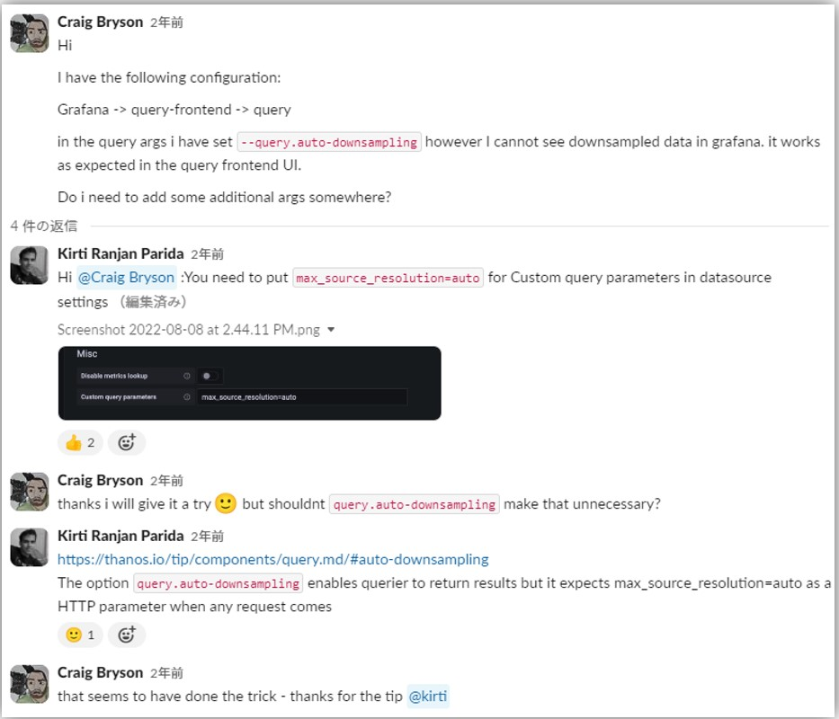
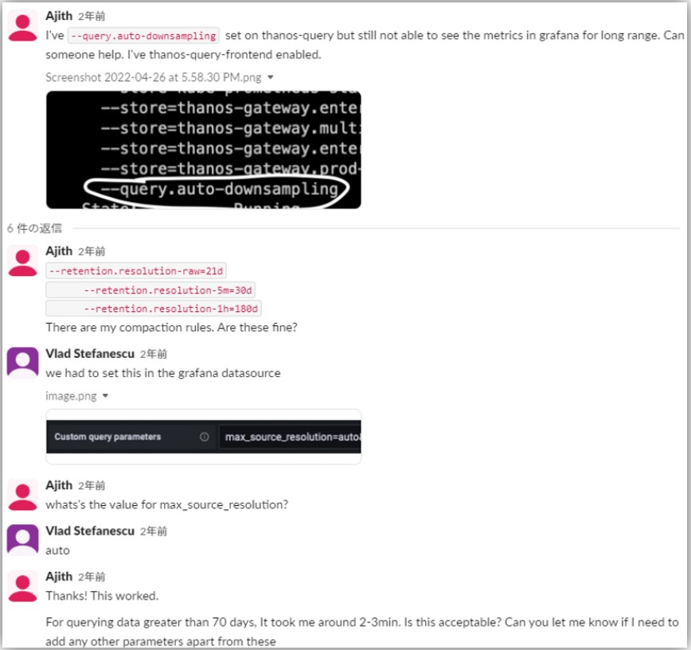
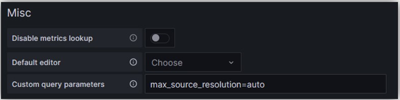

## DownSampledデータ取得のための設定
- Querier実行時`--query.auto-downsampling`フラグを指定
- Query Frontend実行時`--query-range.request-downsampled`フラグを指定  
  > Make additional query for downsampled data in case of empty or incomplete response to range request.  
  
  
- GrafanaのDataSource設定時に「Custom query parameters」に`max_source_resolution=auto`を追加する必要があるみたい  
  
  - `auto`以外に`5m`、`1h`を設定することも可能