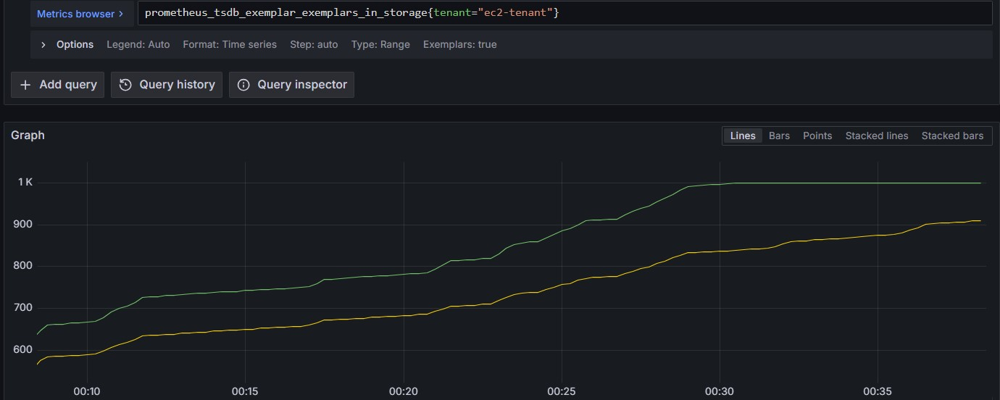

- https://thanos.io/tip/components/receive.md/
- Thanosではデフォルトではexemplarsの受信が無効になっている
- **有効にするためにはReceiver（ingesting-receiver）で`--tsdb.max-exemplars`パラメータを1以上に設定する必要がある**
  - ` --tsdb.max-exemplars`はテナント / Receiver ごとに保存されるexemplarsの数。exemplarsの数が` --tsdb.max-exemplars`に達した場合は、最も古いexemplarsが削除されて新しく入ってきたものが保存される
  - 現在保存されているexemplarsの数は`prometheus_tsdb_exemplar_exemplars_in_storage`メトリクスから確認できる
- ` --tsdb.max-exemplars=1000`で設定した時の`prometheus_tsdb_exemplar_exemplars_in_storage`メトリクスの例（1kで頭打ちしている）  
