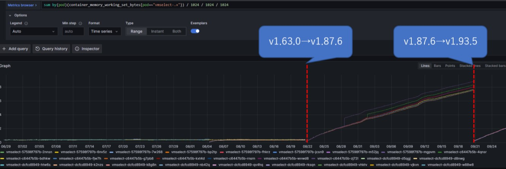
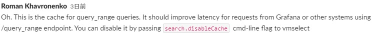

## maxLabelsPerTimeseriesによるlabel dropについて
- vminsertはデフォルトで１メトリクス当たり30個までlabelを受け付けて、それを超えたらvminsertから以下のwarnが出てlabelがdropされる
  ~~~
  warn    VictoriaMetrics/lib/storage/metric_name.go:572  dropping 2 labels for {__name__="container_cpu_usage_seconds_total",container_label_com_docker_compose_config_hash="3e2cf0f09e886926626ad7763b4faa81a573b34f54629befe56f420c2e57b9fe",container_label_com_docker_compose_container_number="1",container_label_com_docker_compose_oneoff="False",container_label_com_docker_compose_project="files",container_label_com_docker_compose_project_config_files="roles/jenkins/files/docker-compose-jenkins.yml",container_label_com_docker_compose_project_working_dir="/root/IaC/Ansible/roles/jenkins/files",container_label_com_docker_compose_service="jenkins",container_label_com_docker_compose_version="1.27.4",container_label_org_label_schema_build_date="20201113",container_label_org_label_schema_license="GPLv2",container_label_org_label_schema_name="CentOS Base Image",container_label_org_label_schema_schema_version="1.0",container_label_org_label_schema_vendor="CentOS",container_label_org_opencontainers_image_created="2020-11-13 00:00:00+00:00",container_label_org_opencontainers_image_description="The Jenkins Continuous Integration and Delivery server",container_label_org_opencontainers_image_licenses="MIT",container_label_org_opencontainers_image_revision="e6e7014de2cfb18b89672fd814b5702e68d2878b",container_label_org_opencontainers_image_source="https://github.com/jenkinsci/docker",container_label_org_opencontainers_image_title="Official Jenkins Docker image",container_label_org_opencontainers_image_url="https://www.jenkins.io/",container_label_org_opencontainers_image_vendor="Jenkins project",container_label_org_opencontainers_image_version="2.346.3",cpu="cpu00",id="/system.slice/docker-2279cf2521a0ef6c97461a225269c953bf684cd8d34ecf741f4b3a7badd82c06.scope",image="jenkins:v1",instance="10.47.58.169:8081",instance_Tag="UNKKOYCI001",instance_id="i-01d391bd44a0b047e",job="ops_common_container",name="jenkins",system="ops_common"}; dropped labels: {name="jenkins",system="ops_common"}; either reduce the number of labels for this metric or increase -maxLabelsPerTimeseries=30 command-line flag value
  warn    VictoriaMetrics/lib/storage/metric_name.go:572  dropping 1 labels for {__name__="container_cpu_load_average_10s",container_label_com_docker_compose_config_hash="3e2cf0f09e886926626ad7763b4faa81a573b34f54629befe56f420c2e57b9fe",container_label_com_docker_compose_container_number="1",container_label_com_docker_compose_oneoff="False",container_label_com_docker_compose_project="files",container_label_com_docker_compose_project_config_files="roles/jenkins/files/docker-compose-jenkins.yml",container_label_com_docker_compose_project_working_dir="/root/IaC/Ansible/roles/jenkins/files",container_label_com_docker_compose_service="jenkins",container_label_com_docker_compose_version="1.27.4",container_label_org_label_schema_build_date="20201113",container_label_org_label_schema_license="GPLv2",container_label_org_label_schema_name="CentOS Base Image",container_label_org_label_schema_schema_version="1.0",container_label_org_label_schema_vendor="CentOS",container_label_org_opencontainers_image_created="2020-11-13 00:00:00+00:00",container_label_org_opencontainers_image_description="The Jenkins Continuous Integration and Delivery server",container_label_org_opencontainers_image_licenses="MIT",container_label_org_opencontainers_image_revision="e6e7014de2cfb18b89672fd814b5702e68d2878b",container_label_org_opencontainers_image_source="https://github.com/jenkinsci/docker",container_label_org_opencontainers_image_title="Official Jenkins Docker image",container_label_org_opencontainers_image_url="https://www.jenkins.io/",container_label_org_opencontainers_image_vendor="Jenkins project",container_label_org_opencontainers_image_version="2.346.3",container_label_restartcount="2",id="/system.slice/docker-2279cf2521a0ef6c97461a225269c953bf684cd8d34ecf741f4b3a7badd82c06.scope",image="jenkins:v1",instance="10.47.58.169:8081",instance_Tag="UNKKOYCI001",job="ops_common_container",name="jenkins",system="ops_common"}; dropped labels: {system="ops_common"}; either reduce the number of labels for this metric or increase -maxLabelsPerTimeseries=30 command-line flag value
  ~~~
- 以下2つのうちどれかで対策
  - labelを減らす
  - vminsert実行時のフラグ`-maxLabelsPerTimeseries`をデフォルトの30から増やす  
    https://docs.victoriametrics.com/Cluster-VictoriaMetrics.html

## `vmselect`のメモリ高騰
- 事象
  - Cluster modeのバージョンを1.63.0から1.87.6に上げてからvmselectのメモリ使用量が上がり続ける事象が発生  
  
- 原因
  - vmselectが`query_range`クエリーのために使うcacheが上り続けていた  
    
  - ただ、なぜバージョンアップで初めて発生したかは不明（VictoriaMetricsの開発者にも確認）
- 対策
  - 実際のキャッシュサイズを表す`vm_cache_size_bytes`メトリクスの`type`が`promql/rollupResult`であることを確認
  - vmselectを`-search.disableCache`フラグ付きで実行