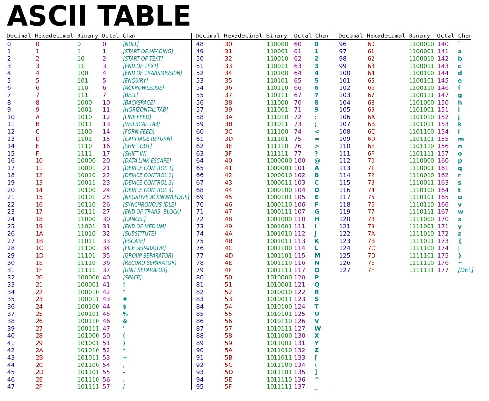
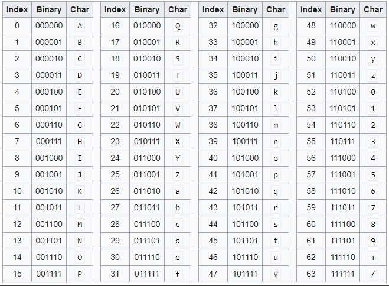

- Base64(encoding)は文字のASCIIバイナリを６bit単位で区切って、６bitごとに区切ったものをBase64 Binaryコード(文字)に変換したもの
  - 例えば"CH"という文字をBase64エンコーディングする場合、CとHはASCIIバイナリでそれぞれ`01000011`,`01001000`になってそれを6bitごとに区切ると`010000`,`110100`,`1000`になる。  
    `010000`はBase64 Charで`Q`に、`110100`は`0`に、`1000`は6bitに満たないのでそういう場合は末尾に0を追加するので`100000`になって`g`になる。  
    最後にBase64エンコードされたデータは常に4文字の倍数になるように設計されていて、4の倍数に満たない場合は`=` (**padding**という) が追加される。  
    よって _**CH**_ をBase64でエンコーディングすると _**Q0g=**_ になる
- ASCII Table

- Base64 Table  
